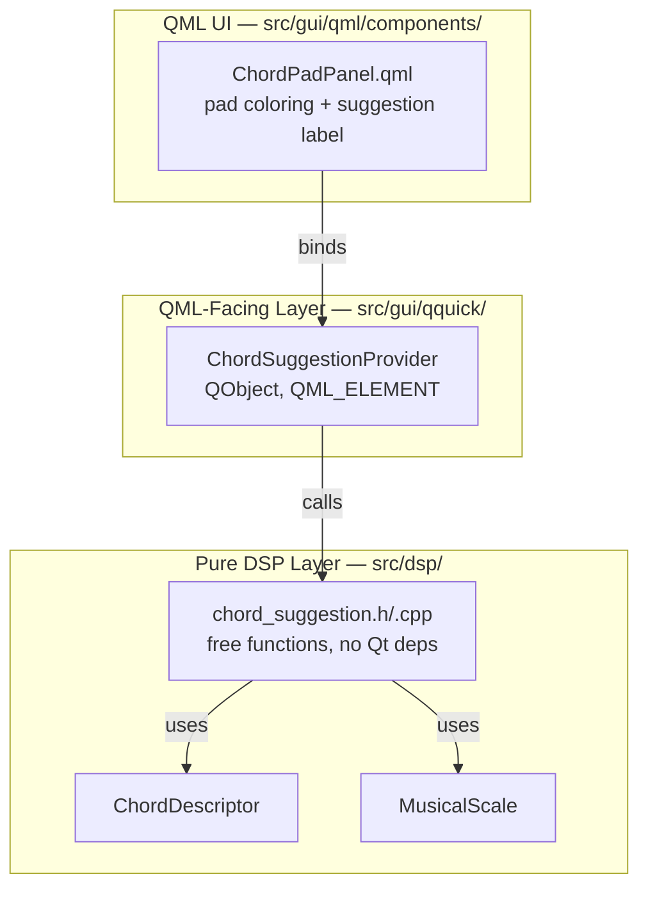
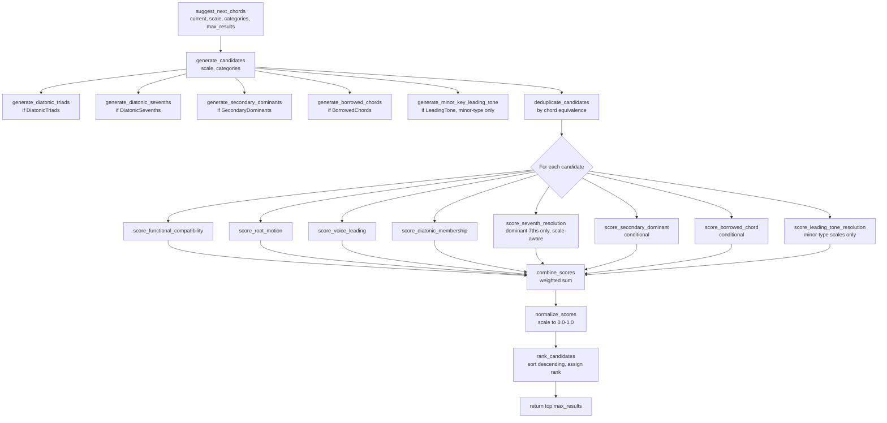

<!---
SPDX-FileCopyrightText: © 2026 Alexandros Theodotou <alex@zrythm.org>
SPDX-License-Identifier: FSFAP
-->

# Chord Suggestion Engine

## Overview

This document describes the design for a chord suggestion engine that ranks
candidate "next chords" based on the currently-played chord and the active
scale. When a user presses a chord on the Chord Pad, the other pads show
an animated score-indicator strip (green-to-red) indicating how natural each
would be as the next chord, and a label shows the top suggested chord names.

The algorithm is based on **functional harmony theory** (Riemann's
*Funktionstheorie*): every chord has a harmonic function (Tonic,
Predominant, or Dominant), and certain transitions between functions are more
"natural" or expected than others. The tension in tonal music tends to flow
**Tonic → Predominant → Dominant → Tonic** (build tension, then release it).
Green chords follow this flow; red chords work against it (retrogression).

### Scope

- **Single-chord context only**: suggestions are based solely on the
  currently-pressed chord, not on the history of chords played. This is
  sufficient for a performance-oriented chord pad and avoids the complexity of
  multi-chord Markov models.
- **Major and minor keys** are fully supported, including harmonic minor
  variants (raised leading tone → V major, #vii°). Only **heptatonic**
  (7-note) scales are supported — the 7×7 transition matrices require exactly
  7 scale degrees. Pentatonic, hexatonic, octatonic, and other non-heptatonic
  scales are not supported (suggestions will return empty for these).
  Unimplemented scale types (where `get_notes_for_type` returns an all-false
  note array) also produce empty results, since they fail the heptatonic
  guard.
- **Modes** (Dorian, Phrygian, Lydian, etc.) are handled by classifying them
  as major-type or minor-type based on their third interval.
- **Five candidate categories** can be toggled independently: diatonic
  triads, diatonic 7ths, secondary dominants, borrowed chords, and the
  raised leading-tone chord (#vii° in minor keys). The leading-tone
  category defaults to on in the chord pad provider.

---

## Architecture



The design follows Zrythm's existing separation of concerns:

- **Pure DSP layer** (`src/dsp/chord_suggestion.h/.cpp`): All scoring logic as
  free functions in `namespace zrythm::dsp::chords`. No Qt dependencies beyond
  what `ChordDescriptor` and `MusicalScale` already pull in. Every function is
  independently unit-testable.
- **QML-facing layer** (`src/gui/qquick/chord_suggestion_provider.h/.cpp`): A
  `QObject` that holds the current chord, current scale, and category
  toggles. Calls the DSP functions and exposes results to QML via properties.
- **QML UI** (`ChordPadPanel.qml`): Colors each pad based on its score and
  displays the top 3 suggestion names.

---

## Data Types

The engine uses three enums and two structs:

- **`ChordCandidateCategory`** — bit flags for which categories of chord
  candidates to generate: `DiatonicTriads` (the 7 basic triads of the scale),
  `DiatonicSevenths` (7th chords), `SecondaryDominants` (V7/X chords),
  `BorrowedChords` (from parallel key), `LeadingTone` (raised #vii° in
  minor keys). All categories are independently toggleable via bitwise
  OR.
- **`HarmonicFunction`** — `Tonic`, `Predominant`, `Dominant`, or `Other`
  (for chromatic chords mapped to a substitute function).
- **`CandidateType`** — how a candidate was generated: diatonic triad,
  diatonic seventh, secondary dominant, borrowed chord, or leading tone.
- **`ChordKey`** — a lightweight POD storing just the chord identity (root
  note, type, accent). `ChordDescriptor` inherits QObject (copy/move deleted
  in Qt6), so it cannot be stored by value in containers; `ChordKey` avoids
  this overhead and can be converted to a temporary `ChordDescriptor` when
  needed.
- **`ChordSuggestion`** — the result of scoring one candidate: the chord key,
  candidate type, overall score (0.0–1.0, normalized), subscores
  (functional, root motion, voice leading), scale degree (0–6, or −1 for
  non-diatonic), harmonic function, and rank (1 = best suggestion).

### Harmonic function to scale degree mapping

The `HarmonicFunction` of each scale degree is used to populate the `function`
field in `ChordSuggestion` results. The mapping is:

**Major-type scales:**

| Degree | Roman numeral | Function |
|---|---|---|
| 0 | I | Tonic |
| 1 | ii | Predominant |
| 2 | iii | Other (tonic substitute, weak — note: iii also has dominant-substitute function in German theory, but iii→I is rare in practice) |
| 3 | IV | Predominant |
| 4 | V | Dominant |
| 5 | vi | Tonic (substitute) |
| 6 | vii° | Dominant |

**Minor-type scales:**

| Degree | Roman numeral | Function |
|---|---|---|
| 0 | i | Tonic |
| 1 | ii° | Predominant |
| 2 | III | Other (relative major / tonic substitute) |
| 3 | iv | Predominant |
| 4 | v / V | Dominant |
| 5 | VI | Tonic (substitute) |
| 6 | VII | Other (dominant parallel — common in rock, weaker in classical) |

Chromatic candidates (secondary dominants, borrowed chords, #vii°) are mapped
to `Other` by default, or to their substitute function when one is determined
during scoring (see [Scoring Factors](#scoring-factors)).

---

## Algorithm Flow



The main entry point `suggest_next_chords()` orchestrates a clear pipeline.
Every box is a standalone pure function — independently testable, no shared
state.

---

## Scoring Factors

Each scoring factor is a pure function returning a float in `[0.0, 1.0]`.
Every function has a thorough doc comment explaining the music theory behind
it.

### 1. `score_functional_compatibility(prev, candidate, scale)`

**Measures**: How "expected" is this scale-degree transition, based on the
harmonic functions (Tonic/Predominant/Dominant) of the two chords.

**How it works**: A `constexpr` 7x7 lookup table — two matrices, one for
major-type scales, one for minor-type (see
[Transition Matrices](#transition-matrices) below). The function:

1. Maps each chord to its scale degree (0-6):
   - **Diatonic chords**: direct degree lookup
   - **Borrowed chords**: mapped to their functional substitute's degree
     before the matrix lookup, then the matrix weight is multiplied by a
     **0.85 substitute discount** — borrowed chords substitute for a
     function but are not the real thing (e.g., ♭VII→I = 1.0 × 0.85 = 0.85,
     correctly below V→I = 1.0 because ♭VII lacks the leading-tone pull).
     Full mapping for C major (borrowing from C minor):

     | Borrowed chord | Substitute degree | Reason |
     |---|---|---|
     | Cm (♭I) | 0 (I) | Same root, tonic function |
     | D° (ii°) | 1 (ii) | Same root, predominant function (diminished instead of minor) |
     | E♭ (♭III) | 5 (vi) | Pragmatic best-fit — produces correct scores for common rock transitions (♭III→I=0.4, ♭III→IV=0.9). Not a standard functional classification; ♭III is a chromatic mediant. |
     | Fm (iv) | 3 (IV) | Same root, subdominant function |
     | Gm (v) | 4 (V) | Same root, dominant function |
     | A♭ (♭VI) | 3 (IV) | Subdominant function (♭VI→V is the key cadence) |
      | B♭ (♭VII) | 4 (V) | Dominant substitute (♭VII→I like V→I) |

     Reverse mapping for A minor (borrowing from A major):

     | Borrowed chord | Substitute degree | Reason |
     |---|---|---|
     | A (I) | 0 (i) | Same root, tonic function (Picardy third) |
     | Bm (ii) | 1 (ii°) | Same root, predominant function (minor instead of diminished) |
     | D (IV) | 3 (iv) | Same root, subdominant function (major instead of minor) |

     (E major is excluded — already covered as harmonic-minor V. C♯m and F♯m
     are on chromatic roots and rarely used.)
   - **Secondary dominants and #vii°**: no meaningful degree — returns a
     neutral base score of **0.5**. Their actual scoring is handled by the
     conditional modifier functions (secondary dominant resolution, leading
     tone resolution).
2. Looks up the base weight from the appropriate matrix
3. Applies quality-based adjustments via `apply_quality_adjustments()`
   for mode-specific and harmonic-minor variants (e.g., major V in minor
   keys gets a bonus over minor v at the dominant degree)

**Example values**: V→I = 1.0 (authentic cadence), IV→V = 1.0
(predominant to dominant), V→IV = 0.2 (retrogressive).

> **Note on VII→i vs ♭VII→I asymmetry**: In a minor key, VII→i (G→Am) scores
> 0.5 from the minor matrix — VII is a diatonic subtonic with weak resolution
> pull. In a major key, ♭VII→I (B♭→C) scores ~0.85 via the borrowed-chord
> substitute discount — ♭VII is a deliberate chromatic borrowing that mimics
> dominant function in rock. The different scores are intentional: these are
> different musical contexts despite involving the same chord shape.

### 2. `score_root_motion(prev_root, candidate_root)`

**Measures**: The strength of the root-note interval change, independent of
scale context.

**How it works**: Computes the directed interval in semitones
(`(next_root - prev_root + 12) % 12`) and maps each value to a score. The
full mapping:

| Semitones up | Interval name | Example | Score |
|---|---|---|---|
| 0 | Unison | C→C | 0.0 |
| 1 | Minor 2nd | C→D-flat | 0.4 |
| 2 | Major 2nd (stepwise) | C→D | 0.5 |
| 3 | Minor 3rd | C→E-flat | 0.7 |
| 4 | Major 3rd | C→E | 0.7 |
| 5 | Perfect 4th (= descending 5th) | G→C | **1.0** |
| 6 | Tritone | C→F-sharp | 0.1 |
| 7 | Perfect 5th (= descending 4th) | C→G | 0.5 |
| 8 | Minor 6th (= descending major 3rd) | C→A-flat | 0.7 |
| 9 | Major 6th (= descending minor 3rd) | C→A | 0.7 |
| 10 | Minor 7th (= descending major 2nd) | C→B-flat | 0.5 |
| 11 | Major 7th (= descending minor 2nd) | C→B | 0.4 |

Interval class 5 (perfect 4th up / descending 5th) is the strongest because it
follows the circle of fifths backward — this is the V→I root motion,
"undoubtedly the most common and the strongest of all harmonic progressions"
(Benward & Saker, *Music: In Theory and Practice*).

### 3. `score_voice_leading(prev, candidate)`

**Measures**: How smoothly the individual voices (notes) move between the two
chords — common tones and minimal semitone displacement.

**How it works**: The MIDI pitches from `ChordDescriptor::getMidiPitches()`
are reduced to **pitch classes (mod 12)** so that octave-offset artifacts from
different chord roots (which start at different absolute octaves) cancel out.
Two separate computations are then performed on these pitch classes:
- **Shared tones**: pitch classes present in both chords. More shared pitch
  classes = higher score.
- **Displacement**: each prev-chord pitch class is paired greedily with its
  nearest unmatched next-chord pitch class, using the **shortest circular
  distance** on the 12-tone modulo space (`min(diff, 12 − diff)`). The
  per-voice average displacement is normalized by a maximum of 6 semitones
  (a tritone). Lower average displacement = higher score.
The bass note is included as a pitch class — if it duplicates an existing
chord tone, it is counted once. The two subscores are combined with equal weight:
```
voice_leading_score = 0.5 × (shared_tones / max_tones)
                    + 0.5 × (1.0 - avg_displacement / 6)
```
where `max_tones` is the smaller chord's tone count and `avg_displacement`
is the average per-voice circular semitone distance (0 = no movement,
6 = tritone or worse per voice).

### 4. `score_diatonic_membership(candidate, scale)`

**Measures**: Does the candidate chord belong to the current scale?

**How it works**: Uses `MusicalScale::containsNote()` per chord tone to
compute the fraction of chord tones that belong to the scale. Fully diatonic
(all tones in scale) = 1.0, partially chromatic = proportional penalty based
on how many tones are out-of-scale, fully non-diatonic = 0.0. (Note: the
existing `containsChord()` method is all-or-nothing and cannot be used for
proportional scoring — it returns `bool` via `std::ranges::all_of`.) This
acts as a penalty weighting against chromatic candidates. Note that at 0.15
weight, this is a mild penalty, not a hard gate — chromatic candidates with
strong functional/root-motion scores can still rank highly, which is
desirable (e.g., a secondary dominant resolving correctly should be
suggested).

### 5. `score_seventh_resolution(prev, candidate, scale)` *(conditional: DiatonicSevenths)*

**Measures**: Does a dominant 7th chord resolve its dissonance to the
expected target?

**How it works**: Only **dominant 7ths** (`ChordAccent::Seventh`) are
processed — major 7ths are consonant color tones and return neutral (0.5).
For a dominant 7th, the function computes the 7th pitch class, then scans
**downward by diatonic step** (using `scale.containsNote()`) to find the
nearest scale note below the 7th. That note is the expected resolution. If
the candidate chord contains it → 1.0; otherwise → 0.0.

This correctly handles both half-step resolutions (e.g., G7's F → E in C
major) and whole-step resolutions (e.g., E7's D → C in C major — a
secondary dominant resolving to the relative minor). The previous
half-step-only logic missed whole-step resolutions entirely.

### 6. `score_secondary_dominant(prev, candidate, scale)` *(conditional: SecondaryDominants)*

**Measures**: Does a secondary dominant resolve to its target?

**How it works**: If `prev` is a secondary dominant of some diatonic chord X,
and `candidate` IS X, very high score. If `prev` is a secondary dominant and
`candidate` is NOT its target, penalty. Also handles the reverse: if
`candidate` is a secondary dominant whose target is the chord that would
naturally follow `prev` (e.g., prev = C major, candidate = D7, because D7
targets G, and G naturally follows C via the functional matrix), moderate
bonus (it sets up a nice resolution chain).

### 7. `score_borrowed_chord(candidate, scale)` *(conditional: BorrowedChords)*

**Measures**: Chromaticism cost of using a borrowed chord.

**How it works**: This function is a no-op — it returns 0.5 (neutral,
producing zero modifier). The chromaticism cost of borrowed chords is
already captured by two other factors: the 0.85 substitute discount in
`score_functional_compatibility` and the naturally-lower
`score_diatonic_membership` (borrowed chords have out-of-scale tones). The
function exists in the pipeline for future extensibility (e.g., genre-
specific borrowed-chord preferences) but currently contributes nothing.

### 8. `score_leading_tone_resolution(prev, candidate, scale)` *(minor-type scales only)*

**Measures**: Does the raised-leading-tone diminished chord (#vii°) resolve
to the tonic?

**How it works**: If `prev` is #vii° (the raised leading tone chord in a
minor key), checks if `candidate` is the tonic (i). If so, returns **1.0**
(leading-tone cadence — the strongest resolution in minor keys). If
`candidate` is not the tonic, returns a low score (0.1–0.2) — #vii° rarely
goes anywhere except home.

This is a special case separate from the 7×7 matrix because #vii° is on a
chromatic root (e.g., G# in A minor) that is not one of the 7 natural minor
degrees, so it cannot be looked up by degree index.

---

## Score Combination

```cpp
struct ScoreWeights {
    float functional    = 0.45f; // The dominant factor
    float root_motion   = 0.25f;
    float voice_leading = 0.15f;
    float diatonic      = 0.15f;
};
```

The conditional factors (7th resolution, secondary dominant, leading tone
resolution) act as **modifiers** (additive +/- adjustments) on the combined
score, not as separate weighted terms. (`score_borrowed_chord` exists in the
pipeline as a placeholder but is a no-op — see below.) This keeps the base
weights stable regardless of which categories are enabled.

**Return-value-to-modifier mapping**: Each conditional function returns a
score in `[0.0, 1.0]` where **0.5 is neutral**. The modifier applied to the
combined score is:

```
modifier = (score − 0.5) × 2 × max_magnitude
```

So a perfect resolution (1.0) yields the full bonus, a neutral evaluation
(0.5) yields zero, and a poor resolution (0.0) yields the full penalty. This
means unresolved dissonances actively penalize the score, not merely fail to
bonus it.

`score_borrowed_chord` is the **exception** — it does not use the modifier
formula. The chromaticism cost is already captured by the 0.85 substitute
discount in `score_functional_compatibility` and the naturally-lower
`score_diatonic_membership`. Applying an additional flat penalty would
triple-count the same quality.

**Maximum modifier magnitudes:**

| Modifier | When applied | Max magnitude |
|---|---|---|
| `score_seventh_resolution` | Dominant 7th resolves / fails to resolve by diatonic step. Major 7ths return neutral. | ±0.10 |
| `score_secondary_dominant` | Sec. dominant → target / non-target | ±0.25 |
| `score_borrowed_chord` | Candidate is a borrowed chord | N/A — no modifier (cost captured by 0.85 discount + diatonic membership) |
| `score_leading_tone_resolution` | #vii° → tonic / other (minor keys) | ±0.25 |

Example: if `score_leading_tone_resolution` returns 0.15 for #vii°→(non-tonic),
the modifier is (0.15 − 0.5) × 2 × 0.25 = **−0.175** (a penalty for failing
to resolve the leading tone).

When a conditional function's precondition is not met (e.g., `prev` is not a
7th chord for `score_seventh_resolution`, or `prev` is not #vii° for
`score_leading_tone_resolution`), it returns **0.5 (neutral)**, producing
zero modifier.

After all modifiers are applied, the combined score may exceed 1.0 or fall
below 0.0 (positive modifiers can sum to ~+0.35 in practice — e.g.,
secondary dominant resolution +0.25 and 7th resolution +0.10 can stack;
most conditions are near-mutually-exclusive). Ranking must be performed
on the **unclamped** combined score to preserve distinction between
strongly-positive candidates. Clamping to [0.0, 1.0] and normalization are
applied **after ranking**, only for display/coloring purposes. If all
candidates score 0.0 (pathological edge case — e.g., all candidates are
non-resolving chromatic chords), normalization leaves all scores at 0.0
rather than dividing by zero.

---

## Transition Matrices

The functional compatibility data lives in two `constexpr` 7x7 lookup tables.

### Major-type matrix

Applies to scales with a major 3rd (Ionian, Lydian, Mixolydian, etc.):

| | I | ii | iii | IV | V | vi | vii° |
|---|---|---|---|---|---|---|---|
| **I** | 0.2 | 0.8 | 0.5 | 0.9 | 0.8 | 0.8 | 0.2 |
| **ii** | 0.4 | 0.2 | 0.2 | 0.5 | 1.0 | 0.3 | 0.4 |
| **iii** | 0.2 | 0.4 | 0.2 | 0.4 | 0.2 | 0.7 | 0.1 |
| **IV** | 0.7 | 0.7 | 0.2 | 0.2 | 1.0 | 0.5 | 0.4 |
| **V** | 1.0 | 0.2 | 0.4 | 0.2 | 0.2 | 0.5 | 0.2 |
| **vi** | 0.4 | 0.7 | 0.6 | 0.9 | 0.4 | 0.2 | 0.1 |
| **vii°** | 1.0 | 0.1 | 0.1 | 0.2 | 0.4 | 0.2 | 0.1 |

Key entries: V→I = 1.0 (cadence), ii→V = 1.0 (ii-V-I), IV→V = 1.0, vii°→I =
1.0 (leading tone), vi→IV = 0.9 (pop progression), V→IV = 0.2
(retrogressive).

### Minor-type matrix

Applies to scales with a minor 3rd (Aeolian, Dorian, Phrygian, etc.):

| | i | ii° | III | iv | v | VI | VII |
|---|---|---|---|---|---|---|---|
| **i** | 0.2 | 0.6 | 0.5 | 0.8 | 0.8 | 0.7 | 0.7 |
| **ii°** | 0.4 | 0.2 | 0.2 | 0.5 | 0.9 | 0.3 | 0.3 |
| **III** | 0.3 | 0.4 | 0.2 | 0.4 | 0.3 | 0.6 | 0.7 |
| **iv** | 0.6 | 0.6 | 0.3 | 0.2 | 0.9 | 0.5 | 0.5 |
| **v** | 0.7 | 0.2 | 0.4 | 0.2 | 0.2 | 0.4 | 0.3 |
| **VI** | 0.4 | 0.6 | 0.6 | 0.7 | 0.4 | 0.2 | 0.5 |
| **VII** | 0.5 | 0.3 | 0.7 | 0.6 | 0.4 | 0.5 | 0.2 |

Key differences from major: v→i = 0.7 (weaker than V→i because minor v is a
weaker dominant), VII→III = 0.7 (relative major shift).

### Harmonic minor adjustments

In minor keys, the raised leading tone (from harmonic minor) creates stronger
dominant-function chords. There are two cases, handled differently:

**Case 1: V major (quality variant at degree 4)** — The dominant degree (v)
in natural minor is minor. Harmonic minor raises the 3rd to produce a major
V on the **same root**. This is a quality variant that CAN be looked up in
the 7×7 matrix. The `apply_quality_adjustments()` function (called in step 3
of `score_functional_compatibility`) applies specific patches for
major-quality V outgoing transitions:

| Transition | Natural minor (v) | Harmonic minor (V) | Reason |
|---|---|---|---|
| V→i | 0.7 | **1.0** | Raised leading tone creates strong pull to tonic |
| V→VI | 0.4 | **0.5** | Increased tension makes the deceptive cadence more dramatic |
| others | unchanged | unchanged | |

This covers all transitions where the raised leading tone meaningfully
affects the perceived strength.

**Case 2: #vii° (chromatic chord on raised leading tone)** — The raised
leading tone (e.g., G# in A minor) is NOT one of the 7 natural minor scale
degrees — it is a chromatic root. Therefore #vii° (e.g., G#° in A minor)
**cannot** be looked up in the 7×7 matrix. It is handled as a special case:

1. Generated by `generate_minor_key_leading_tone(scale)` for minor-type
   scales (always included, not a toggle — it is fundamental to minor key
   harmony).
2. Scored by `score_leading_tone_resolution(prev, candidate, scale)`:
   - #vii° → i: **1.0** (leading-tone cadence, the strongest minor-key
     resolution)
   - #vii° → V: **0.3** (uncommon — G# is already the 3rd of E, so only
     one voice actively resolves; not a true leading-tone resolution)
   - #vii° → anything else: low score (0.1–0.2), like other unresolved
     chromatic chords

This distinction matters because V major and #vii° look superficially
similar (both come from harmonic minor) but require completely different
handling: V is a matrix-quality patch, while #vii° is a chromatic-root
special case.

### Mode classification

For non-major/non-minor scales (Dorian, Lydian, etc.), the matrix is chosen
by **third quality**: if the scale has a minor 3rd, use the minor matrix;
major 3rd, use the major matrix. This is computed once by `is_minor_type()`.

> **Mode quality adjustments**: When a degree's actual chord quality (from
> `get_diatonic_triads()`) differs from the reference scale's expected
> quality (Ionian for major-type, Aeolian for minor-type), a general
> function `apply_quality_adjustments(prev, candidate, scale)` applies a
> small bonus or penalty. It is **direction-aware** — it considers both the
> prev and candidate chord, since the same quality change can strengthen or
> weaken a transition depending on direction:
>
> | Actual vs expected | Effect | Example |
> |---|---|---|
> | Candidate is major instead of minor | +0.10 (more stable destination) | Dorian's IV |
> | Candidate is minor instead of major | −0.10 (less stable destination) | Mixolydian's v |
> | Candidate is diminished | −0.15 (unstable destination) | Mixolydian's iii° |
> | Candidate is minor instead of diminished | +0.10 (more stable) | Dorian's ii |
> | Candidate is major instead of diminished | +0.15 (much more stable) | Phrygian's ♭II |
> | Prev is major instead of minor | +0.10 (stronger departure — raised leading tone) | Harmonic minor's V |
> | Prev is a dominant-function diminished chord (vii°, #vii°), candidate is tonic | +0.15 (resolution bonus) | vii°→I (major), #vii°→i (minor) |
>
> This covers all mode-specific quality differences automatically, without
> per-mode data tables. The harmonic-minor V→i boost (0.7 + 0.10 general +
> 0.20 cadence special = 1.0) is a special case on top of this, because it is
> a cadence, not just a quality difference.
>
> *Note: the V→VI harmonic-minor patch (0.4→0.5) shown in the Case 1 table is
> not a special case — it is exactly the "prev is major instead of minor"
> general rule firing (+0.10). It is listed alongside V→i for readability,
> since both are consequences of the same raised leading tone.*

---

## Candidate Generation

### `generate_diatonic_triads(scale)`

Uses the existing `MusicalScale::get_diatonic_triads()` to get the diatonic
triads. This returns `static_vector<DiatonicTriad, 12>` (each containing
`root_note` + `chord_type`), **not** `ChordDescriptor` objects. The function
must construct a `ChordDescriptor` from each `DiatonicTriad` (setting root
note, type, and default accent/inversion/bass). Returns empty for
unimplemented scale types or non-heptatonic scales. Example for C major: C,
Dm, Em, F, G, Am, B°.

### `generate_diatonic_sevenths(scale)`

Extends each diatonic triad with its diatonic 7th. The 7th quality is
determined by the scale. Example for C major: Cmaj7, Dm7, Em7, Fmaj7, G7,
Am7, Bm7b5.

> **Implementation note**: In the codebase, 7ths are modeled as `ChordAccent`
> layered on a triad `ChordType` (e.g., G7 = `ChordType::Major` +
> `ChordAccent::Seventh`), not as a separate `ChordType`. The generator must
> derive the correct `ChordAccent` from the scale (using
> `MusicalScale::isAccentInScale()` to determine whether `Seventh` or
> `MajorSeventh` applies at each degree), then construct the `ChordDescriptor`
> with the appropriate accent. For half-diminished (Bm7b5), verify that
> `ChordType::Diminished` + `ChordAccent::Seventh` produces the expected
> intervals via `get_intervals_for_type_and_accent()`.

### `generate_secondary_dominants(scale)`

For each diatonic chord X (except I and vii°), generates V7/X — the dominant
7th chord that resolves to X. I is excluded because V7/I is already the
diatonic V7 chord (redundant); vii° is excluded because it is rarely
tonicized. Example for C major: D7 (resolves to G), A7
(resolves to Dm), E7 (resolves to Am), B7 (resolves to Em), C7 (resolves to
F). In minor keys, V7/i is excluded (it is already covered by the
harmonic-minor V via the quality adjustment mechanism — generating it twice
would be redundant).

### `generate_borrowed_chords(scale)`

Generates chords from the parallel key (parallel minor for a major key, and
vice versa). For major keys: borrows from parallel minor (C major borrows
from C minor: Ab, Bb, Cm, D°, Eb, Fm, Gm — Gm is included for completeness
but is rarely borrowed in practice; D° (D-F-A♭) is a common borrowed
predominant — its root overlaps the diatonic ii but it is a completely
different chord with A♭ instead of A). For minor keys: borrows from parallel
major (A minor borrows from A major: A, Bm, D; E excluded as harmonic-minor
V, G#° excluded as #vii° — both already covered by other generators; C♯m and
F♯m excluded as rare chords on roots chromatic to the minor scale).

> **Note on ♭VII origin**: ♭VII may arise from parallel-minor borrowing or
> from Mixolydian mode influence — both are valid sources. The engine treats
> them identically since the chord behaves the same either way.

> **Known scope limitations**: Secondary leading-tone chords (vii°7/X, e.g.
> F#°7→G in C major) and augmented sixth chords / Neapolitan (♭II) are not
> generated. These are common in classical and jazz but less relevant for the
> chord pad's pop/rock/jamming use case. They can be added as a future
> candidate category.

### `generate_minor_key_leading_tone(scale)`

For minor-type scales only. Generates the raised-leading-tone diminished
chord (#vii°) that is fundamental to minor key harmony. Example for A
minor: G#° (G#-B-D). This chord is on a chromatic root (the raised 7th
degree) and is scored specially — see `score_leading_tone_resolution()`
above. Gated by the `LeadingTone` category bit, which the chord pad
provider includes by default.

### Candidate deduplication

After all generators produce their candidates, `generate_candidates()`
deduplicates by chord equivalence (same root note + type + accent). This
handles overlaps such as V7/III = VII7 in minor keys (both are G7 in A
minor — the secondary dominant of III and the diatonic 7th of VII). When
a duplicate is found, the first-generated instance wins (generator priority:
diatonic triads > diatonic 7ths > secondary dominants > borrowed chords >
leading tone).

---

## UI Integration

The DSP layer is wrapped by a `ChordSuggestionProvider` QML type that holds
the current chord, current scale (read from the chord track at the playhead
position), and category toggles. When any input changes, it calls
`suggest_next_chords()` and exposes the results via QML properties.

The chord pad panel uses the provider in two ways:

- **Score-indicator strip**: each pad has a thin animated strip along its
  bottom edge. The strip's width encodes the suggestion score magnitude
  (higher score = wider strip), and its color encodes the score hue
  (green = strong suggestion, red = weak). An entry animation expands the
  strip from the center + fades in; an exit animation fades out + contracts.
  A `scoreToColor()` helper maps scores 0.0–1.0 through red → yellow → green
  via HSL hue interpolation.
- **Top suggestions label**: a row of colored labels showing the top N
  chord names (configurable via a `maxSuggestions` property, default 5).
  Suggestions auto-clear after 3 seconds of inactivity.

Scores below 0 (no current chord or no scale) produce no visual indicator —
pads remain in their neutral state.
