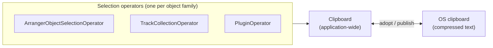
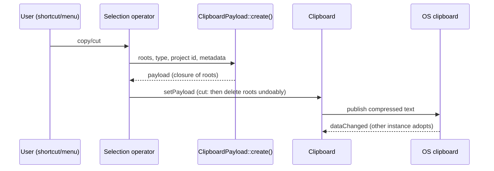
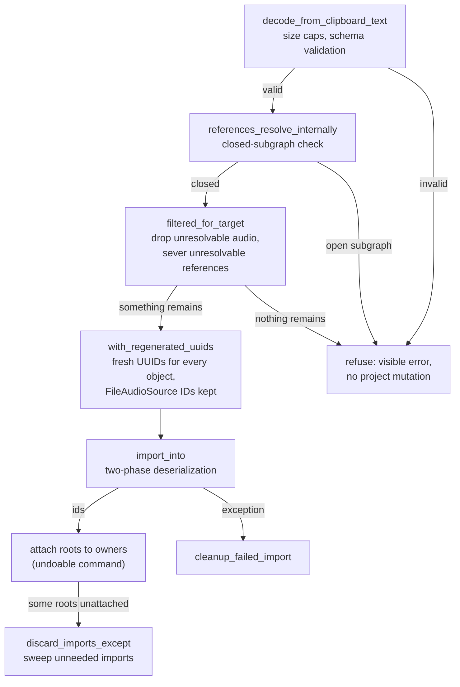
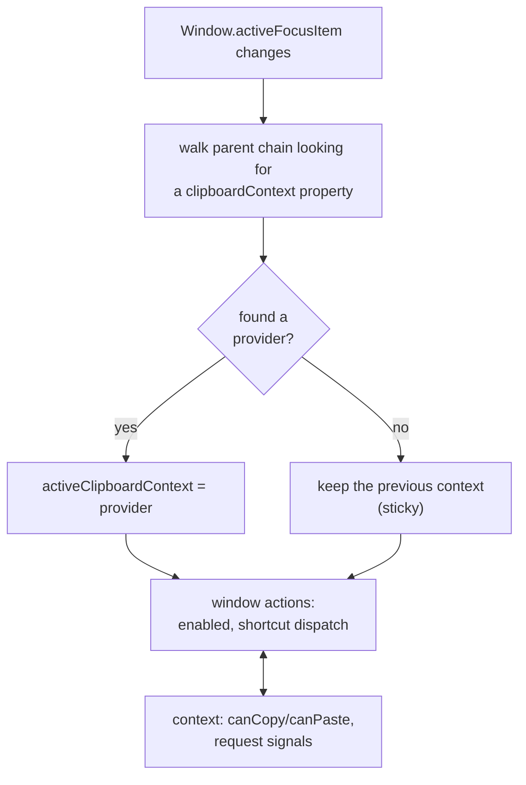

<!---
SPDX-FileCopyrightText: © 2026 Alexandros Theodotou <alex@zrythm.org>
SPDX-License-Identifier: FSFAP
-->

# Clipboard System (Cut/Copy/Paste/Duplicate)

This document describes how Zrythm's clipboard works end to end: the
payload format, the copy and paste flows over the project registry,
cross-project paste, the focus-routed QML integration, and how paste
interacts with undo.

## Overview

The clipboard covers three object families, each with its own
selection operator implementing copy/cut/paste/duplicate:

- **Arranger objects** (regions, MIDI notes, automation points,
  chords, markers) via `ArrangerObjectSelectionOperator`
- **Tracks** (with their lanes, plugins and routing) via
  `TrackCollectionOperator`
- **Plugins** (with their parameters, ports and modulations) via
  `PluginOperator`

All operators share one application-wide
[`Clipboard`](../../src/controllers/clipboard.h) instance. It holds
the in-process payload and bridges it to the OS clipboard as
compressed text, which is what makes paste work across projects and
across Zrythm instances. When the system clipboard changes and
holds a valid payload written by another instance, it is adopted
automatically. Unrelated clipboard contents are ignored; the
in-process payload stays untouched.



## Payload format

A
[`ClipboardPayload`](../../src/structure/project/clipboard_payload.h)
is a self-contained snapshot of the copied objects, in the same
format the project file uses for its registry:

- **Flat buckets** — `ports`, `parameters`, `plugins`, `tracks`,
  `automationTracks`, `lanes`, `clipSlots`, `arrangerObjects`,
  `fileAudioSources` — holding every object reachable from the
  copied roots
- **Root UUIDs** — the bucket entries the user actually selected
- **Per-type metadata** — free-form paste context, e.g. the copied
  group's anchor position for arranger objects, or the copied
  tracks' output routing and folder nesting
- **Envelope** — a `ZrythmClipboard` document discriminator (so
  foreign text is never mistaken for a payload), a format version,
  and the source project's identity for same-project paste decisions

The structure is validated by a JSON schema embedded into the binary
at build time. Unknown properties, wrong types and payloads past
the size bounds are rejected before any deserialization work runs.

### The UUID-string invariant

**All inter-object references serialize as bare UUID strings.**

This one rule carries most of the system: the closure computation at
copy time and the ID remapping at paste time both work by walking
the serialized JSON and following (or rewriting) those strings — no
per-family reference-walking code exists. A new reference field is
automatically part of the clipboard as long as it is a UUID-valued
string somewhere in the object's serialized form.

Two details:

- **Only string values are collected; object keys are not.** A map
  keyed by UUID, e.g. the track payload's folder nesting

  ```json
  { "folderParents": { "<child UUID>": "<parent UUID>" } }
  ```

  is covered only because the same UUIDs also appear as values
  somewhere in the closure — every bucket entry carries its own
  `id` as a value. The remapper renames mapped keys too, so they
  never dangle; new metadata that references objects *only* as keys
  must add a value-form reference.
- **Boundary keys may point outside the payload by design:**
  - channel send destination ports
  - parameter modulation source ports
  - the routing target of track metadata (e.g. the master track)

  A boundary reference either points at a copied root (included on
  its own) or at an object that stays outside the paste. At paste
  time it is kept when it resolves in the target and severed when
  it does not.

## Copy and cut

`ClipboardPayload::create()` computes the transitive closure of the
selected roots: every UUID reference found in a visited object's
serialized JSON is followed, and the referenced object is included.
Cut takes the payload first, then deletes the roots undoably.



## Paste

Paste is a pipeline of validation and derivation steps followed by
a single mutation:



Validation runs before any mutation: a refused paste leaves the
project untouched. A failed import is rolled back by deleting
exactly the objects it registered (`cleanup_failed_import`). When
only some roots end up attached — e.g. a paste lands where some
roots don't validate — the imported objects outside the kept roots'
closure are swept (`discard_imports_except`) instead of being left
unowned.

Plugin instantiation starts during import and may finish
asynchronously. Track and plugin pastes wait for every imported
plugin's instantiation status to leave `Pending` (bounded by a 30
second timeout); a plugin that fails or times out refuses the whole
paste. Arranger-object pastes never carry plugins: payloads with a
non-empty `plugins` or `tracks` bucket are refused up front, so no
wait is needed.

## Why pasted copies get new IDs

Pasting never reuses the copied objects' UUIDs:

- **The registry refuses duplicate IDs.** Every project object is
  registered under its UUID; a second object with the same ID would
  make every reference ambiguous.
- **References are ID-based.** The remapper gives the paste fresh
  UUIDs and rewrites every mention, so references *between* pasted
  objects point at the pasted copies, not at the originals — the
  copies form a self-consistent subgraph.
- **Shared audio is the exception.** `FileAudioSource` UUIDs are
  kept on purpose: audio clips reference pooled assets — shared
  across clips rather than owned by them — so pasting reuses (or
  re-registers) the same pool entry instead of duplicating audio
  data.

## Cross-project paste

The envelope carries the source project's identity. At paste time:

- **Audio whose file audio source is not registered in the target
  is dropped and reported to the user.** The frames live in a pool
  entry the target does not have — cross-project, that is always
  the case; in the same project it means the source was purged
  after the copy.
- **External references that don't resolve in the target are
  severed** (send destinations erased, modulation sources cleared).
- Resolvability is **registry membership, not current existence**:
  references to objects deleted undoably are kept, because the
  target can still restore them by undo — the same way references
  survive undoable deletions inside a project.

## QML integration (focus-routed contexts)

Shortcuts and menus route through per-view **clipboard contexts**.
Each context-providing view exposes a `ClipboardContext` object
with capability flags (`canCopy`, `canPaste`) and request signals
(`copyRequested`, `cutRequested`, `pasteRequested`,
`duplicateRequested`). The window owns the four clipboard `Action`s
(standard-key shortcuts and enabled state) and resolves the active
context from keyboard focus:



The resolver is **sticky**: it only switches the context when the
focused item has a provider. Focus moving to the menu bar, an open
menu, a button or a text field therefore keeps the last resolved
context — which is why menu items stay enabled while their menu is
open.

The context property clears automatically when the providing view
is destroyed (QML nulls QObject-typed properties on destruction).
Text inputs consume the standard edit shortcuts themselves while
focused.

Contexts are provided by the arranger, the tracklist view (passed
down to track delegates) and the plugin slot lists (passed down to
slot delegates). The same context gates the window actions and the
views' context menus, so keyboard and menu behavior cannot drift
apart.

## Undo integration

Every paste/cut mutation is one undoable command. Because objects
are owned through the registry, commands reference pasted objects
by **owner handles** (UUID + expected type) instead of raw pointers:
handles survive re-instantiation, cannot dangle, and fail loudly
when resolved against a stale project generation. See
[undo_system.md](undo_system.md) § "Owner Handles in Commands" for
the full contract.

## Testing map

| Suite | Covers |
|---|---|
| `tests/unit/controllers/clipboard_test.cpp` | clipboard service, OS bridge, adoption |
| `tests/unit/structure/project/clipboard_payload_test.cpp` | payload format, closure, remap, import, filtering |
| `tests/unit/actions/arranger_object_selection_operator_test.cpp` | arranger object copy/cut/paste/duplicate |
| `tests/unit/actions/track_collection_operator_test.cpp` | track paste incl. lane clip content, instantiation wait |
| `tests/unit/actions/plugin_operator_test.cpp` | plugin cut/copy/paste |
