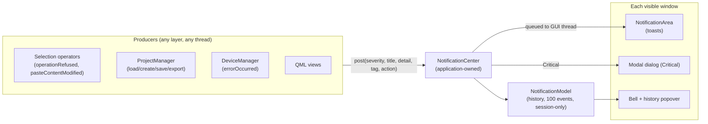

<!---
SPDX-FileCopyrightText: © 2026 Alexandros Theodotou <alex@zrythm.org>
SPDX-License-Identifier: CC-BY-SA-4.0
-->

# Notification System

How user-facing messages — successes, transient problems, failures and
blocking errors — travel from any producer in the application to the
user, and how they are remembered.

The presentation side (toast anatomy, severity colors, lifetimes, the
bell and its history popover) is owned by the
[Notifications section of DESIGN.md](../../DESIGN.md#notifications);
this document owns the architecture behind it.

## Overview

Three principles drive the design:

- **Explicit reporting.** Messages reach the user only through
  `NotificationCenter::post()`. The logging pipeline
  (`z_debug`…`z_critical`, `z_rt_*`) stays developer-facing; nothing is
  auto-routed to the UI.
- **Severity decides surface.** Info/Success/Warning/Error are toasts
  with per-severity lifetimes; Critical opens a modal dialog. Every
  notification, including Critical ones, is recorded in the history.
- **The actions layer stays GUI-free.** Semantic signals
  (`operationRefused` and friends) are forwarded into the center by the
  window that receives them; `src/actions/` never depends on
  `src/gui/`.

## Components

### NotificationCenter

Application-owned object on `ZrythmApplication` (same idiom as
`ProjectManager`, reached from QML via `GlobalState.application`). It
routes posts to the history and the visible window; presentation lives
entirely in QML.

- `post(severity, title, detail, context_tag, action_label, callback)`
  — callable from any thread; delivery to the GUI thread goes through
  a queued invocation. Not real-time-safe: it allocates and queues
- `postInfo`/`postSuccess`/`postWarning`/`postError`/`postCritical`
  convenience wrappers (`Q_INVOKABLE`, callable from QML)
- `acknowledgeAll()`, `clearHistory()`, `unacknowledgedCriticals()`

Every post logs once on the calling thread, with the severity name in
the message (`[notification] [Error] …`) so entries stay greppable by
severity.

### Notification

A `QObject` created by `NotificationCenter::post()`, with read-only
`severity`, `title`, `detail`, `contextTag`, `timestamp` and
`actionLabel` properties, an `actionCallback` property (QML lambdas
only) and a writable `acknowledged` property. Notifications are owned
by the center for the center's lifetime; models and views hold bare
pointers, and removing a notification from the history does not delete
it.

Acknowledgment is a property write on the notification itself
(`notification.acknowledged = true`); the history model reacts to the
change signal, so views and the bell badge follow.

#### Actions

An action pairs a button label with a callback supplied by the
producer; no central id registry exists. Two carriers are supported:

- a **QML lambda** (`QJSValue`), passed as the trailing `post*`
  argument. QML closures must not cross threads, so the action is
  dropped (with a warning) when the post is made off the GUI thread.
  A closure whose captured objects die degrades gracefully: property
  writes are skipped, method calls raise a `TypeError` that
  `triggerAction()` reports
- a **C++ lambda** (`std::function<void()>`), passed to the
  six-argument `post()` overload. The callback is copied through the
  queued delivery and invoked on the GUI thread when the action is
  activated; producers capture receivers via `QPointer` when the
  receiver may be destroyed before activation. Exceptions from the
  callback are reported, never propagated to the caller

An action must always carry both a label and a callback; a post with
only one half is dropped with a warning. Actions are toast-only: a
Critical post opens a modal dialog, which has no action button, so an
attached action is dropped with a warning. `triggerAction()` runs
whichever callback is set and reports failures. Activating the action
dismisses the toast and acknowledges the notification; a coalesced
toast activates the newest occurrence's callback.

### NotificationModel

`QAbstractListModel` over the retained history: the most recent 100
events, session-only, never persisted. Every posted occurrence is
stored as its own row — the history does not coalesce; only visible
toasts do. Acknowledgment is observed per notification and emitted as
row changes; `clearHistory()` drops all rows without deleting the
notifications. The model exposes `unacknowledgedAttentionCount` and
`highestUnacknowledgedAttentionSeverity` (Warning/Error only) for the
bell badge.

### NotificationArea

One instance per window (Greeter, ProjectWindow), gated on window
visibility so exactly the visible window presents toasts and modals.
At most three toasts are visible; further events queue in arrival
order and appear as slots free. Critical posts open the window's modal
dialog; everything else renders as a toast per DESIGN.md. Critical
notifications posted before a window exists are presented when an
area is created.

Explicit dismissal — close button, click, Escape or the action —
acknowledges every occurrence the toast absorbed; expiry acknowledges
nothing.

### Bell and history popover

`NotificationCenterButton` shows a badge counting unacknowledged
Warning/Error occurrences, capped at "9+" and colored by the highest
unacknowledged severity. `NotificationCenterPopover` lists the history
with relative timestamps and a Clear All action; opening and closing
it acknowledges everything. The bell lives in the project window
toolbar and the Greeter's navigatable-page header; the transient
progress page shows no toolbar and relies on toasts and modals.

## Severity and logging

| Severity | Surface | Lifetime | Logged at |
|---|---|---|---|
| Info | toast | 5 s | `z_info` |
| Success | toast | 5 s | `z_info` |
| Warning | toast | 10 s | `z_warning` |
| Error | toast | 30 s | `z_warning` |
| Critical | modal dialog | until acknowledged | `z_warning` |

User-facing messages are expected runtime conditions, not defects, so
they never log above warning: the error log level prints a backtrace
and aborts, and critical exits the process — both are reserved for
bugs.

## Threading

`post()` may be called from worker threads, JUCE device callbacks or
QtConcurrent continuations: delivery to the GUI thread goes through a
queued invocation, and all signals the QML layer consumes are emitted
on the GUI thread only.

Real-time audio contexts must not call `post()` (it allocates); they
use the realtime logger.

## Coalescing

Two events coalesce when they share **severity, title and context
tag**. Coalescing applies to visible and queued toasts only: a new
event joins the toast presenting it and bumps its ×N count, restarting
its dismissal timer. Producers assign the context tag (e.g.
`plugin:<uuid>`, `export`) to control what merges; omitting it merges
only identical titles.

## Producers

| Source | Severity | Notes |
|---|---|---|
| `operationRefused` (selection operators) | Error | forwarded by ProjectWindow |
| `pasteContentModified` | Warning | content dropped / references severed summaries |
| `pluginImporter.instantiationFailed` | Error | |
| `projectManager.projectLoadingFailed` | Critical | posted by the application; the Greeter only navigates |
| Save/export/load future failure | Critical | `QFutureQmlWrapper` outcome signals |
| `deviceManager.errorOccurred` | Error | |
| Failed plugin loads at project load | Warning | aggregated via `ProjectManager::pluginsFailedToLoad` |

**i18n policy:** titles and reasons meant for the user are translated
at the producer (`tr()`/`qsTr`); `detail` (exception messages, paths)
may stay technical English.

## Testing

- `tests/unit/gui/backend/notification_center_test.cpp` — delivery and
  history semantics, action carriers, logging, cross-thread behavior
- `tests/unit/gui/qml/tst_NotificationArea.qml` — toast presentation,
  coalescing, queueing, dismissal acknowledgment, actions
- `tests/unit/gui/qml/tst_NotificationBell.qml` — badge counts,
  popover acknowledgment
- `tests/unit/gui/qquick/qfuture_qml_wrapper_test.cpp` — the outcome
  signals that drive save/export/load failure reporting
