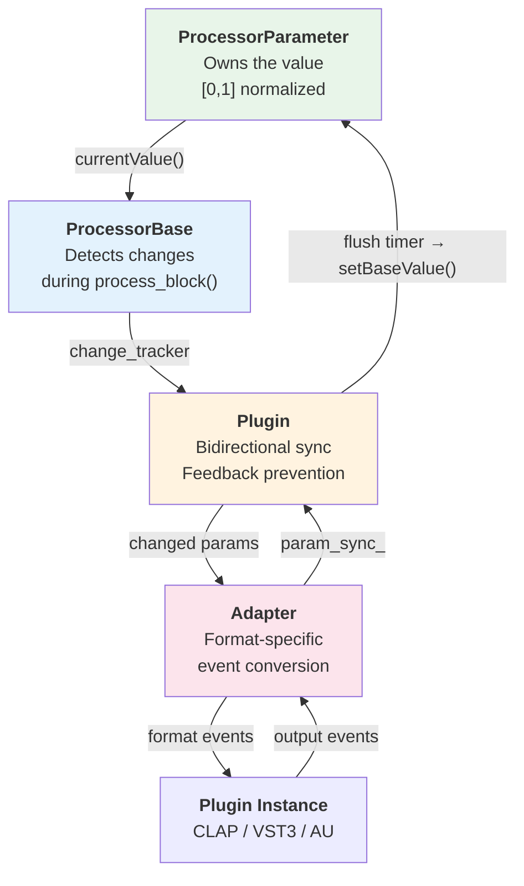
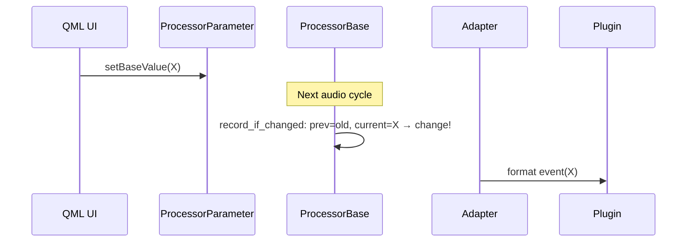
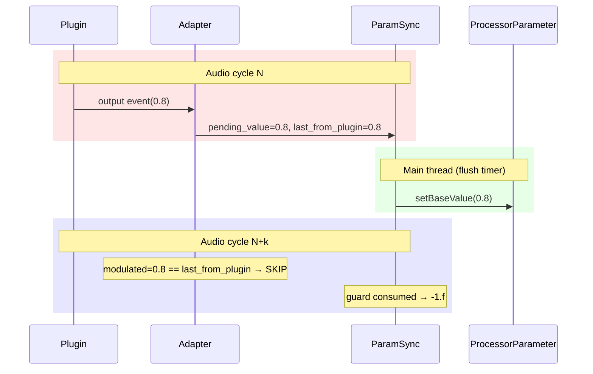
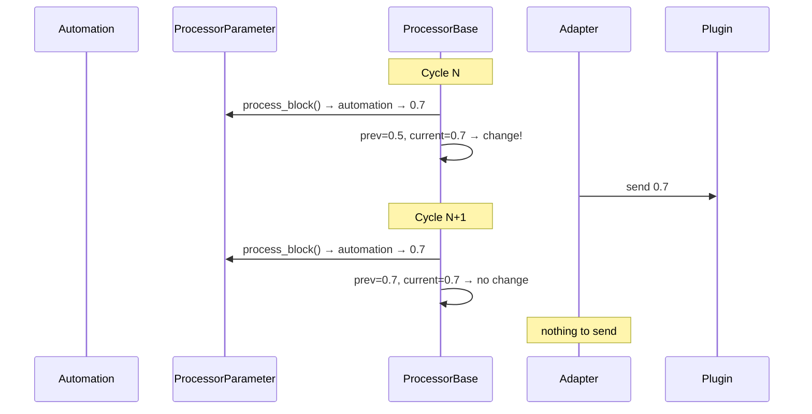

<!---
SPDX-FileCopyrightText: © 2026 Alexandros Theodotou <alex@zrythm.org>
SPDX-License-Identifier: FSFAP
-->

# Processor & Plugin Parameter Infrastructure

## 1. Overview

Parameters flow through four layers, each with a clear responsibility:



| Layer | Source | Owns |
|-------|--------|------|
| **ProcessorParameter** | `src/dsp/parameter.h` | The parameter value, range metadata, Qt signals |
| **ProcessorBase** | `src/dsp/processor_base.h` | Change detection during the processing loop |
| **Plugin** | `src/plugins/plugin.h` | Bidirectional sync state, cross-thread bridge |
| **Adapter** | `src/plugins/clap_plugin.*`, `juce_plugin.*` | Format-specific event conversion |

## 2. ProcessorParameter

Each parameter is a normalized float in \[0, 1\] with an associated `ParameterRange`
(linear, toggle, integer) that maps between normalized and display values.

### Value pipeline

During each audio cycle, `process_block()` computes the final value through three
stages:

1. **Base value** — set by the user via UI or restored from JSON (`setBaseValue()`)
2. **Automation** — if an automation track is connected, its value overrides the base
3. **Modulation** — if a CV/modulation source is connected, its signal offsets the
   automated value

The result is exposed via `currentValue()`. The intermediate value (after automation,
before modulation) is available via `valueAfterAutomationApplied()`.

### Thread boundary

`setBaseValue()` is called from the main thread and emits Qt signals.
`process_block()` runs on the audio thread and reads the base value through an
`std::atomic<float>`. No Qt signals are emitted from the audio thread.

## 3. ProcessorBase

`ProcessorBase` owns a collection of parameters, ports, and a processing cache that
holds pointers to the live objects used during audio processing.

### ParameterChangeTracker

The tracker detects which parameters changed between processing cycles. It lives
inside `BaseProcessingCache` and is populated during the existing parameter loop —
no extra passes:

```
for each parameter:
    parameter.process_block()          // apply automation + modulation
    tracker.record_if_changed(param)   // compare prev vs current
```

Each `Change` records the parameter index, base value, automated value, and
modulated value. After `custom_process_block()` returns (the adapter has consumed
the changes), the tracker is cleared.

The tracker is only accessible during `custom_process_block()` via an
`is_processing_` flag with RAII guard.

## 4. Plugin

`Plugin` extends `ProcessorBase` with bidirectional synchronization state and a
main-thread flush mechanism.

### ParamSync

Each parameter has a `ParamSync::Entry`:

| Field | Thread | Purpose |
|-------|--------|---------|
| `last_from_plugin` | Audio only | One-shot feedback prevention guard |
| `pending_value` | Audio → Main | Cross-thread bridge (`atomic<float>`, -1.f sentinel) |

**Feedback prevention**: When the plugin reports a value X, `last_from_plugin` is set
to X. On the next audio cycle, if the computed value matches X, the adapter skips
sending X back to the plugin and consumes the guard (resets to -1.f). This breaks
the feedback loop after exactly one cycle.

**Cross-thread bridge**: The audio thread stores the plugin-reported value in
`pending_value` with release ordering. A QTimer (~20ms) on the main thread exchanges
it with -1.f and calls `setBaseValue()`, which emits Qt signals for the UI.

### Flush timer

`flush_plugin_values()` iterates all `param_sync_` entries, exchanges any non-sentinel
`pending_value`, and calls `setBaseValue()`. This is the only path from
plugin-reported values to Qt signals.

## 5. Adapter Patterns

Both CLAP and JUCE adapters follow the same contract using the shared
infrastructure:

### Host → Plugin

Iterate `change_tracker().changes()`, apply feedback prevention, convert to
format-specific events:

| Adapter | Method | Sends |
|---------|--------|-------|
| ClapPlugin | `generateChangedParamInputEvents()` | `CLAP_EVENT_PARAM_VALUE` |
| JucePlugin | `sync_changed_params_to_juce()` | `juce_param->setValue()` |

### Plugin → Host

Store plugin-reported values in `param_sync_`:

| Adapter | When | How |
|---------|------|-----|
| ClapPlugin | During `process()` output events | Write `pending_value` + `last_from_plugin` |
| JucePlugin | `parameterValueChanged()` callback | Write `pending_value`; set `last_from_plugin` only on audio thread |

JUCE's callback fires on both threads. On the audio thread (during `processBlock`),
the feedback guard is set. On the message thread (UI interaction), `flush_plugin_values()`
is called directly for immediate feedback.

### Main-thread param flush (CLAP-specific)

CLAP has a `paramsFlush()` mechanism that allows parameter exchange without running
the full audio pipeline. `paramFlushOnMainThread()` sends all current `baseValue()`s
to the plugin and flushes any pending plugin values. JUCE has no equivalent — it
only exchanges parameters during `processBlock()`.

## 6. Common Flows

### User edits a parameter in the DAW UI



### User tweaks plugin GUI knob



### Automation during playback



## 7. Thread Safety

| State | Thread | Mechanism |
|-------|--------|-----------|
| `base_value_` write | Main | `std::atomic<float>` |
| `base_value_` read | Audio | `std::atomic<float>` |
| Change tracking | Audio only | No synchronization needed |
| `last_from_plugin` | Audio only | Plain float, no synchronization |
| `pending_value` store | Audio | `std::memory_order_release` |
| `pending_value` exchange | Main | `std::memory_order_acq_rel` |
| `setBaseValue()` + Qt signals | Main only | Enforced by design |

The sentinel value -1.f is used throughout for "no value" since normalized parameter
values are always \[0, 1\]. This avoids NaN, which is incompatible with `-ffast-math`.

## 8. Future Work

### Gesture support

When a user begins adjusting a parameter in the plugin GUI, the host should suppress
automation on that parameter until the gesture ends. This can be added with:

- An `std::atomic<bool> gesture_active` flag on `ParamSync::Entry`
- A `should_suppress_automation_for_param()` virtual hook on `ProcessorBase` that
  `process_block()` checks before applying automation
- CLAP's `CLAP_EVENT_PARAM_GESTURE_BEGIN/END` and JUCE's
  `parameterGestureChanged()` would set/clear the flag

This is a minor addition (~20 lines) that fits cleanly into the existing architecture.
