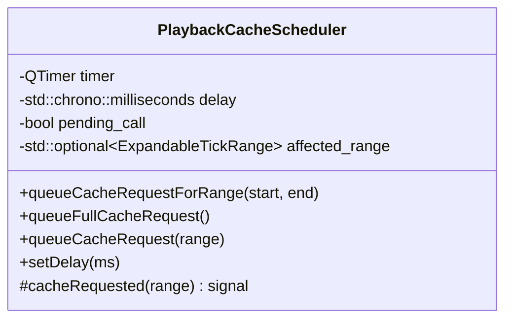
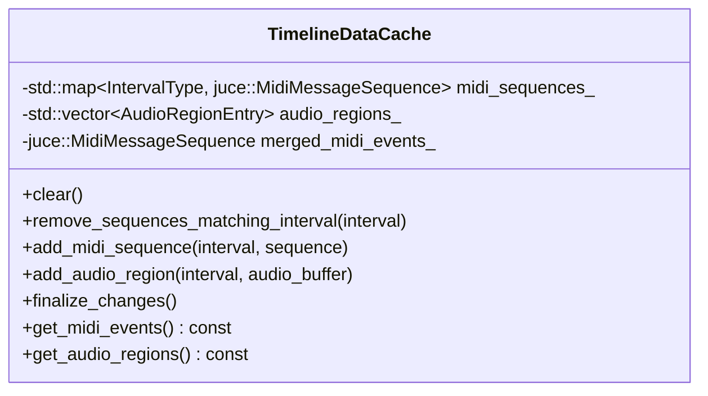
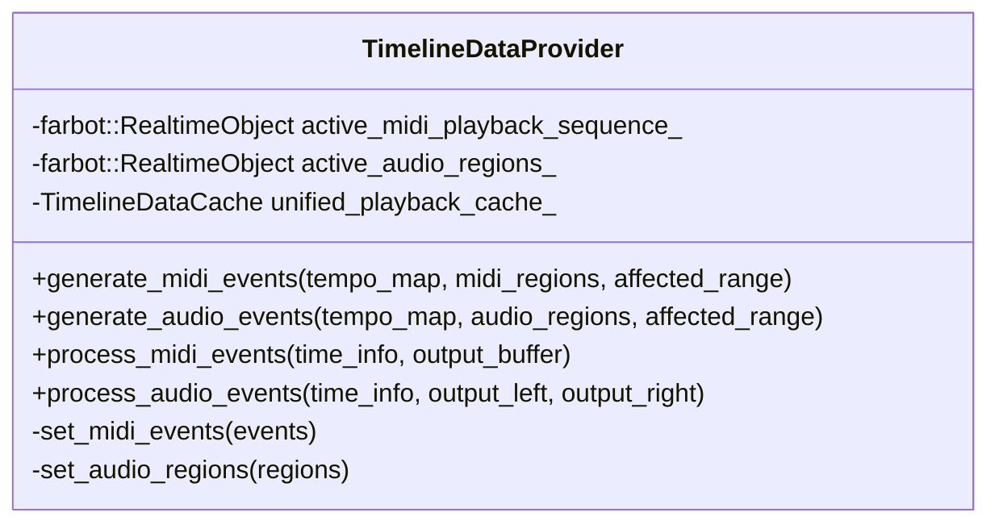
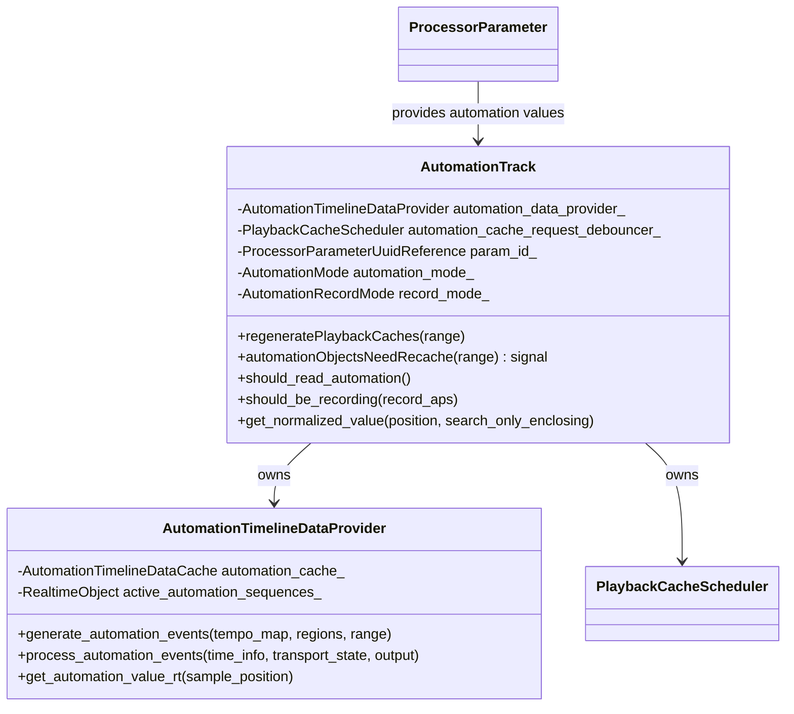
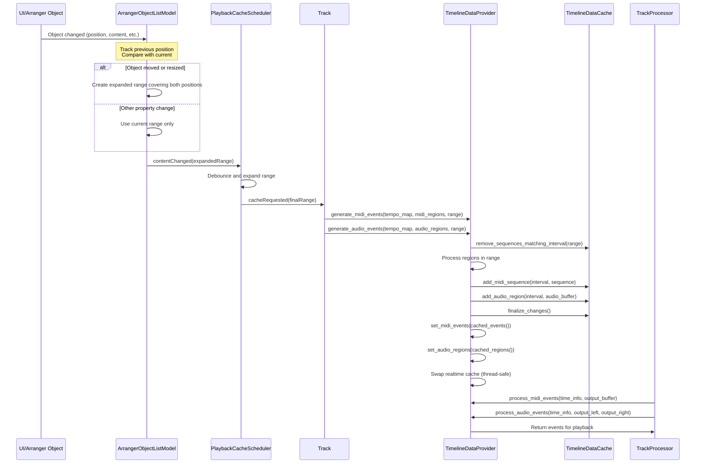
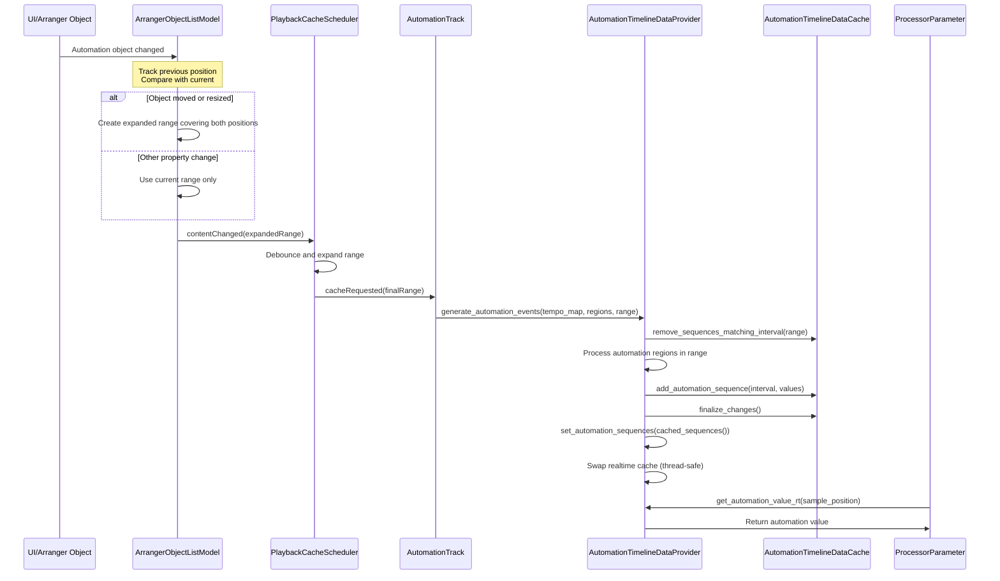

<!---
SPDX-FileCopyrightText: © 2025 Alexandros Theodotou <alex@zrythm.org>
SPDX-License-Identifier: FSFAP
-->

# Playback Cache Architecture

## Overview

This document describes the architecture for caching track events for real-time playback. The system provides thread-safe caching of MIDI, audio, and automation events to prevent threading issues between UI operations and real-time audio processing.

## Problem Statement

The architecture solves the problem described in [GitLab issue #5140](https://gitlab.zrythm.org/zrythm/zrythm/-/work_items/5140) where reading live data from the UI while audio threads are processing causes threading conflicts. Previously, the engine had to be stopped on each edit, causing poor user experience.

## Architectural Goals

- **Thread Safety**: Allow UI modifications while audio processing continues uninterrupted
- **Performance**: Minimize overhead for real-time audio processing
- **Flexibility**: Support multiple event types (MIDI, audio, automation)
- **Efficiency**: Only update changed portions of the timeline
- **Debouncing**: Avoid excessive cache regeneration during rapid UI changes

## Key Components

### 1. PlaybackCacheScheduler

Located in [`src/utils/playback_cache_scheduler.h`](src/utils/playback_cache_scheduler.h)

**Purpose**: Collects and debounces cache requests, then triggers cache generation.

**Key Features:**
- Debounces multiple rapid requests into single operations
- Expands affected ranges to ensure complete coverage
- Configurable delay for optimal performance



### 2. ExpandableTickRange

Located in [`src/utils/expandable_tick_range.h`](src/utils/expandable_tick_range.h)

**Purpose**: Represents a range of ticks that can be expanded to include additional ranges.

**Key Features:**
- Can represent full content or specific ranges
- Supports range expansion operations
- Handles conversion between ticks and samples

### 3. TimelineDataCache

Located in [`src/dsp/timeline_data_cache.h`](src/dsp/timeline_data_cache.h)

**Purpose**: Cache holder that manages event sequences for playback.

**Key Features:**
- Stores MIDI, audio and automation sequences by interval for efficient updates
- Validates event boundaries and ensures note completeness
- Merges sequences for final playback
- Creates independent copies of audio data for thread safety
- Removes data that overlaps with specified intervals



### 4. TimelineDataProvider

Located in [`src/structure/arrangement/timeline_data_provider.h`](src/structure/arrangement/timeline_data_provider.h)

**Purpose**: Bridge between the playback cache system and track processors (or automation tracks), providing events for real-time playback.

**Key Features:**
- Generates MIDI event sequences from timeline regions
- Generates audio region data from timeline regions
- Generates sample-accurate automation data from automation regions
- Manages thread-safe access to cached events using `farbot::RealtimeObject`
- Processes events for specific time ranges during audio processing
- Handles range-based cache updates for efficiency
- Provides consistent interface for event processing



### 5. Track, TrackProcessor, and AutomationTrack Integration

**Track** ([`src/structure/tracks/track.h`](src/structure/tracks/track.h)):
- Owns the `TimelineDataProvider` instance
- Contains `PlaybackCacheScheduler` for managing requests
- Connects to arrangement object changes

**TrackProcessor** ([`src/structure/tracks/track_processor.h`](src/structure/tracks/track_processor.h)):
- Uses `TimelineDataProvider` for MIDI and audio event access
- Implements the playback interface using cached events
- Integrates with the track's event provider system
- Provides unified processing for both MIDI and audio events

**AutomationTrack** ([`src/structure/tracks/automation_track.h`](src/structure/tracks/automation_track.h)):
- Owns an `AutomationTimelineDataProvider` instance for automation-specific caching
- Contains its own `PlaybackCacheScheduler` for debouncing automation cache requests
- Connects to automation region changes via `ArrangerObjectOwner` signals
- Provides real-time automation value access through the parameter's automation provider
- Handles automation mode (Read/Record/Off) and recording mode (Touch/Latch) logic
- More self-contained than Track/TrackProcessor integration as it manages a single parameter's automation



## Signal Flow

The caching process follows this sequence for Tracks:



The caching process for AutomationTracks follows a similar but more self-contained sequence:



## Real-time Safety

The architecture ensures real-time safety through:

1. **RealtimeObject**: Uses `farbot::RealtimeObject` for atomic cache swapping in `TimelineDataProvider`
2. **Debouncing**: Prevents cache thrashing during rapid UI changes
3. **Range-based Updates**: Only processes affected portions of the timeline
4. **Separation of Concerns**: UI thread manages cache generation, audio thread uses cached data
5. **Event Provider Pattern**: `TimelineDataProvider` abstracts the cache access pattern
6. **Independent Copies**: Audio data is copied into the cache to prevent threading issues
7. **Unified Processing**: Both MIDI and audio use the same threading and caching patterns
8. **Transport State Handling**: Providers detect transport state transitions and send all-notes-off when stopping
9. **Buffer Management**: Providers add to buffers rather than clearing them (caller's responsibility)

## Event Types Support

### Currently Implemented
- **MIDI Events**: Fully implemented with region-based caching via `MidiTimelineDataProvider`
- **Audio Events**: Fully implemented with region-based caching via `AudioTimelineDataProvider`
- **Automation Events**: Fully implemented with region-based caching via `AutomationTimelineDataProvider` in AutomationTracks

### Future Extensibility

The architecture is designed to support additional event types:
- Unified cache system for different event types
- Configurable caching strategies per event type
- Event provider pattern for different event types
- Consistent threading patterns across all event types

## Performance Considerations

- **Debounce Timing**: 100ms default delay balances responsiveness and performance
- **Range Optimization**: Only processes changed regions, not entire timeline
- **Memory Efficiency**: Caches are stored in optimal formats for playback
- **CPU Usage**: Cache generation happens off the real-time thread
- **Event Provider Efficiency**: `TimelineDataProvider` optimizes event access patterns
- **Audio Buffer Management**: Efficient copying and management of audio sample data
- **Unified Processing**: Both MIDI and audio benefit from the same performance optimizations

## Error Handling

- **Validation**: Events are validated to ensure they fit within specified intervals
- **Note Completeness**: Ensures all note-on events have corresponding note-offs
- **Tempo Awareness**: Properly handles tempo changes through tempo map integration
- **Provider Safety**: `TimelineDataProvider` handles edge cases in event processing
- **Audio Buffer Independence**: Ensures cached audio buffers are independent copies
- **Cross-Type Validation**: Consistent error handling across MIDI and audio event types
- **Transport State Safety**: Providers handle transport state transitions safely, sending all-notes-off on all 16 MIDI channels when transport stops
- **Buffer Clearing**: Audio/MIDI buffers are properly cleared by the TrackProcessor at the start of every cycle to prevent stuck audio

## Usage Examples

### MIDI Cache Generation
```cpp
// In Track::regeneratePlaybackCaches
timeline_data_provider_->generate_midi_events(
    base_dependencies_.tempo_map_,
    lanes_view(),
    affectedRange
);
```

### Audio Cache Generation
```cpp
// In Track::regeneratePlaybackCaches
timeline_data_provider_->generate_audio_events(
    base_dependencies_.tempo_map_,
    audio_regions_view(),
    affectedRange
);
```

### Automation Cache Generation
```cpp
// In AutomationTrack::regeneratePlaybackCaches
auto children = get_children_view();
automation_data_provider_.generate_automation_events(
    tempo_map_.get_tempo_map(),
    children,
    affectedRange
);
```

### Real-time MIDI Cache Access
```cpp
// In TrackProcessor::fill_midi_events
timeline_data_provider_->process_midi_events(
    time_info,
    output_buffer
);
```

### Real-time Audio Cache Access
```cpp
// In TrackProcessor::fill_audio_events
timeline_data_provider_->process_audio_events(
    time_info,
    output_left,
    output_right
);
```

### Real-time Automation Cache Access
```cpp
// In AutomationTrack constructor - setting up automation provider
parameter()->set_automation_provider([this](auto sample_position) {
    return automation_mode_.load() == AutomationMode::Read
        ? automation_data_provider_.get_automation_value_rt(sample_position)
        : std::nullopt;
});
```

## Cache Invalidation for Object Movement

A key feature of the playback cache architecture is intelligent cache invalidation when objects are moved or resized. The `ArrangerObjectListModel` tracks previous positions of objects and ensures cache is invalidated at both previous and current positions.

### Implementation Details

1. **Previous Position Tracking**: The `ArrangerObjectListModel` maintains a cache of previous positions for all objects using their UUIDs as keys.

2. **Change Detection**: When an object's properties change, the model compares the previous and current positions to detect movement or resizing.

3. **Range Expansion**: If movement is detected, the cache invalidation range is expanded to cover both the previous and current positions, preventing stale cache at the old location.

4. **Lifecycle Management**: The previous position cache is properly maintained during object addition, removal, and property changes.

### Benefits

- **Complete Cache Invalidation**: Ensures no stale cached data remains at previous positions
- **Efficient Processing**: Only expands ranges when necessary (on actual movement)
- **Thread Safety**: Maintains existing thread-safety guarantees
- **Minimal Overhead**: Uses efficient data structures and only tracks necessary information

## Related Components

- **ArrangerObjectListModel**: Propagates change notifications with intelligent cache invalidation
- **TrackLaneList**: Contains MIDI regions and triggers cache updates
- **RegionRenderer**: Renders regions to plain data (MIDI sequences, audio buffers, sample-accurate automation)
- **TempoMap**: Provides timing conversion between ticks and samples
- **TimelineDataProvider**: Bridge between cache system and track processors
- **ClipLauncherEventProvider**: Handles clip-based MIDI and audio event processing
- **ClipPlaybackDataProvider**: Provides unified MIDI and audio processing for clip launcher

## Conclusion

This caching architecture provides a robust solution for thread-safe playback. The addition of specialized timeline data providers (`MidiTimelineDataProvider`, `AudioTimelineDataProvider`, and `AutomationTimelineDataProvider`) with their respective caches creates a clean separation between cache management and real-time event processing, improving maintainability and extensibility. The system balances performance, flexibility, and real-time safety while providing comprehensive support for MIDI, audio, and automation event caching. The AutomationTrack integration demonstrates the architecture's flexibility in handling specialized use cases with a more self-contained approach compared to the broader Track/TrackProcessor integration.
