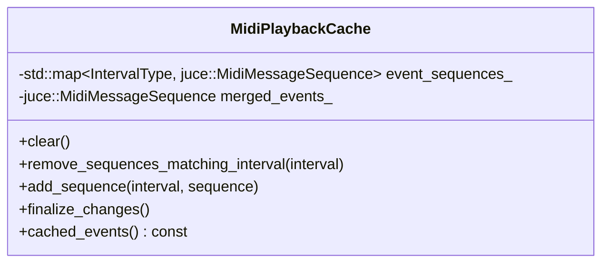
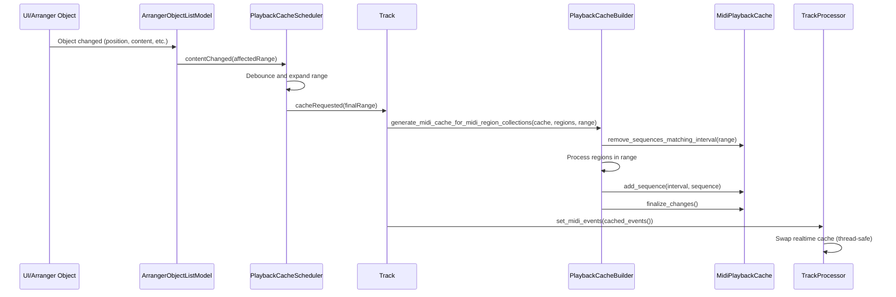

# Playback Cache Architecture

## Overview

This document describes the architecture for caching track events for real-time playback. The system provides thread-safe caching of MIDI, audio, and automation events to prevent threading issues between UI operations and real-time audio processing.

## Problem Statement

The architecture solves the problem described in [GitLab issue #5140](https://gitlab.zrythm.org/zrythm/zrythm/-/work_items/5140) where reading live data from the UI while audio threads are processing causes threading conflicts. Previously, the engine had to be stopped on each edit, causing poor user experience.

## Architectural Goals

- **Thread Safety**: Allow UI modifications while audio processing continues uninterrupted
- **Performance**: Minimize overhead for real-time audio processing
- **Flexibility**: Support multiple event types (MIDI, audio, automation)
- **Efficiency**: Only update changed portions of the timeline
- **Debouncing**: Avoid excessive cache regeneration during rapid UI changes

## Key Components

### 1. PlaybackCacheScheduler

Located in [`src/utils/playback_cache_scheduler.h`](src/utils/playback_cache_scheduler.h)

**Purpose**: Collects and debounces cache requests, then triggers cache generation.

**Key Features:**
- Debounces multiple rapid requests into single operations
- Expands affected ranges to ensure complete coverage
- Configurable delay for optimal performance


### 2. ExpandableTickRange

Located in [`src/utils/expandable_tick_range.h`](src/utils/expandable_tick_range.h)

**Purpose**: Represents a range of ticks that can be expanded to include additional ranges.

**Key Features:**
- Can represent full content or specific ranges
- Supports range expansion operations
- Handles conversion between ticks and samples

### 3. MidiPlaybackCache

Located in [`src/dsp/midi_playback_cache.h`](src/dsp/midi_playback_cache.h)

**Purpose**: Stateful cache holder that manages MIDI event sequences for playback.

**Key Features:**
- Stores sequences by interval for efficient updates
- Validates event boundaries and ensures note completeness
- Merges sequences for final playback



### 4. PlaybackCacheBuilder

Located in [`src/structure/tracks/playback_cache_builder.h`](src/structure/tracks/playback_cache_builder.h)

**Purpose**: Generates and updates playback caches from arrangement objects.

**Key Features:**
- Processes MIDI regions and converts to sample-based timing
- Handles range-based updates for efficiency
- Integrates with tempo map for accurate timing

### 5. Track and TrackProcessor Integration

**Track** ([`src/structure/tracks/track.h`](src/structure/tracks/track.h)):
- Owns the `MidiPlaybackCache` instance
- Contains `PlaybackCacheScheduler` for managing requests
- Connects to arrangement object changes

**TrackProcessor** ([`src/structure/tracks/track_processor.h`](src/structure/tracks/track_processor.h)):
- Uses `farbot::RealtimeObject` for thread-safe cache swapping
- Provides the `active_midi_playback_sequence_` for real-time access
- Implements the playback interface using cached events

## Signal Flow

The caching process follows this sequence:



## Real-time Safety

The architecture ensures real-time safety through:

1. **RealtimeObject**: Uses `farbot::RealtimeObject` for atomic cache swapping
2. **Debouncing**: Prevents cache thrashing during rapid UI changes
3. **Range-based Updates**: Only processes affected portions of the timeline
4. **Separation of Concerns**: UI thread manages cache generation, audio thread uses cached data

## Event Types Support

### Currently Implemented
- **MIDI Events**: Fully implemented with region-based caching
- **Audio Events**: Planned similar to MIDI implementation
- **Automation Events**: Will be handled in AutomationTracks

### Future Extensibility

The architecture is designed to support additional event types:
- Template-based cache system for different event types
- Unified interface for all playback event caches
- Configurable caching strategies per event type

## Performance Considerations

- **Debounce Timing**: 100ms default delay balances responsiveness and performance
- **Range Optimization**: Only processes changed regions, not entire timeline
- **Memory Efficiency**: Caches are stored in optimal formats for playback
- **CPU Usage**: Cache generation happens off the real-time thread

## Error Handling

- **Validation**: Events are validated to ensure they fit within specified intervals
- **Note Completeness**: Ensures all note-on events have corresponding note-offs
- **Tempo Awareness**: Properly handles tempo changes through tempo map integration

## Usage Examples

### MIDI Cache Generation
```cpp
// In Track::regeneratePlaybackCaches
PlaybackCacheBuilder::generate_midi_cache_for_midi_region_collections(
    midi_playback_cache_,
    lanes_view(),
    base_dependencies_.tempo_map_,
    affectedRange
);
```

### Real-time Cache Access
```cpp
// In TrackProcessor::fill_midi_events
decltype(active_midi_playback_sequence_)::ScopedAccess<farbot::ThreadType::realtime>
    midi_seq{ active_midi_playback_sequence_ };
// Use midi_seq for real-time playback
```

## Related Components

- **ArrangerObjectListModel**: Propagates change notifications
- **TrackLaneList**: Contains MIDI regions and triggers cache updates
- **MidiRegionSerializer**: Converts MIDI regions to message sequences
- **TempoMap**: Provides timing conversion between ticks and samples

## Conclusion

This caching architecture provides a robust solution for thread-safe playback. It balances performance, flexibility, and real-time safety while providing a foundation for future expansion to support audio and automation event caching.
