<!---
SPDX-FileCopyrightText: © 2025 Alexandros Theodotou <alex@zrythm.org>
SPDX-License-Identifier: FSFAP
-->

# Plugin Group Architecture

## Overview

Plugin Group provides a unified container system for implementing racks, layers, and plugin containers. It supports recursive nesting, serial/parallel processing, and type-safe signal routing.

## Core Concepts

### Universal Container
Plugin Group serves as a universal container that can represent:
- Simple plugin wrapper with fader
- Serial processing chain
- Parallel processing layers
- Nested rack structures

### Processing Types
- **Serial**: Process elements sequentially, connecting output to next input
- **Parallel**: Process elements separately and sum outputs

### Signal Types
- **Audio**: Audio effects and processing devices
- **MIDI**: MIDI effects and processing devices
- **Instrument**: Instrument generators and related effects

*Note: While we use "plugin" terminology, these can also be referred to as "devices" in UI/documentation.*

## Architecture Overview

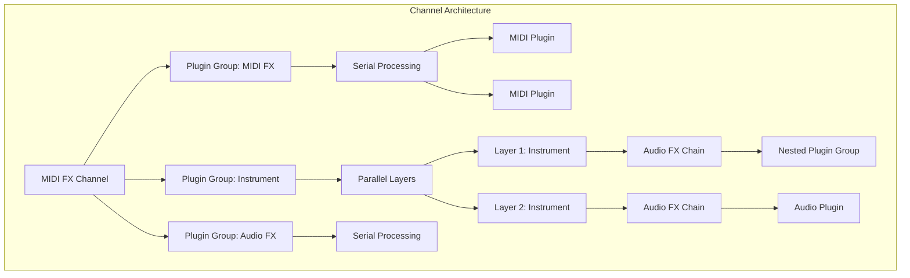

## Component Structure

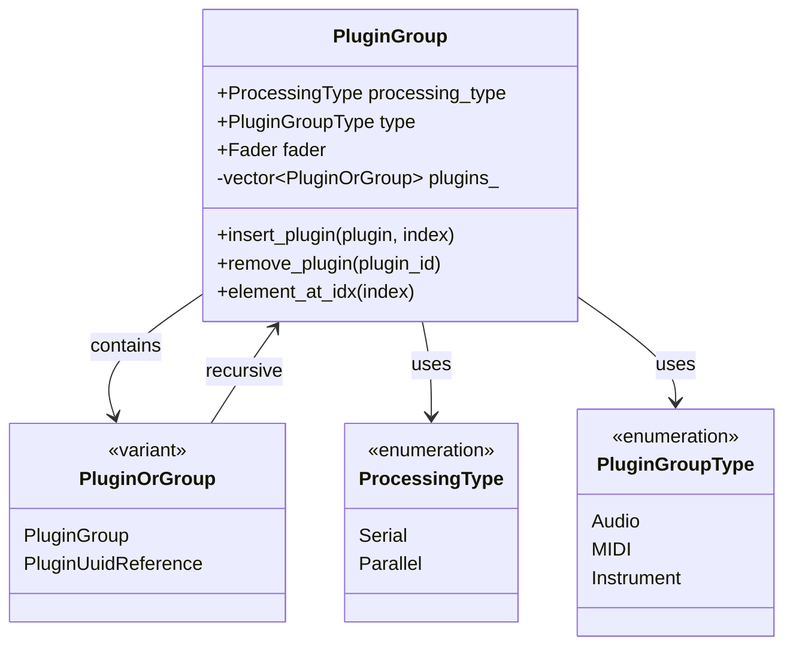

## Signal Flow Patterns

### Serial Processing
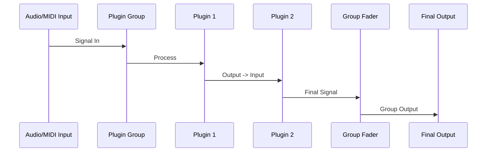

### Parallel Processing
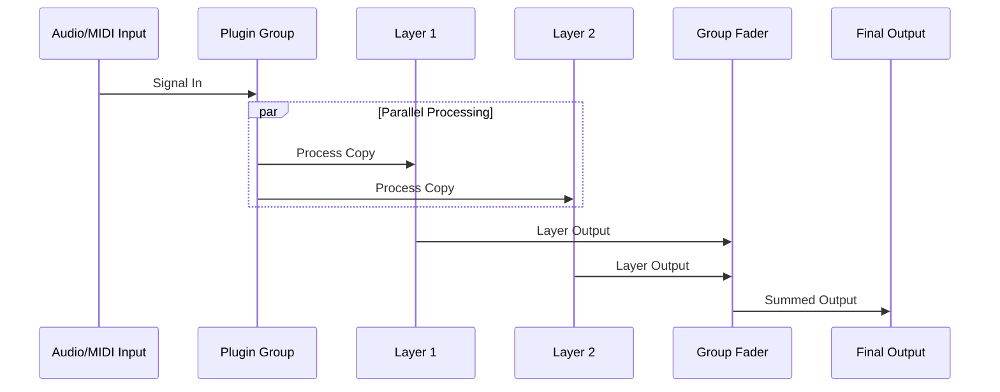

## Channel Integration

Each channel contains three main Plugin Group containers:

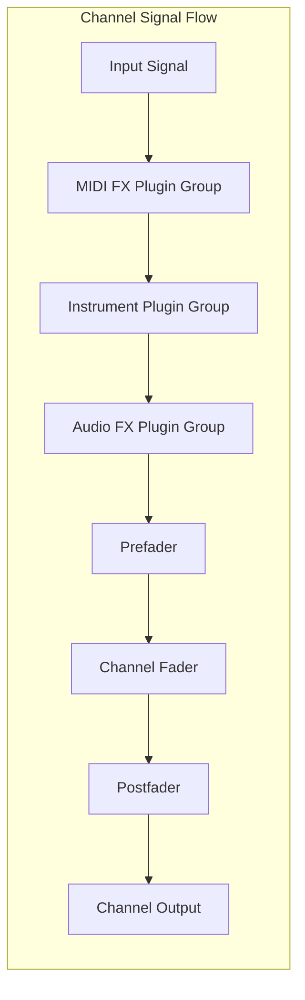

## Real-time Processing

### DSP Graph Integration
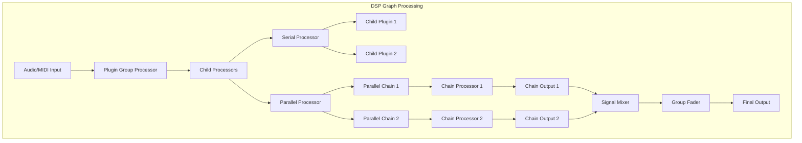

## QML Integration

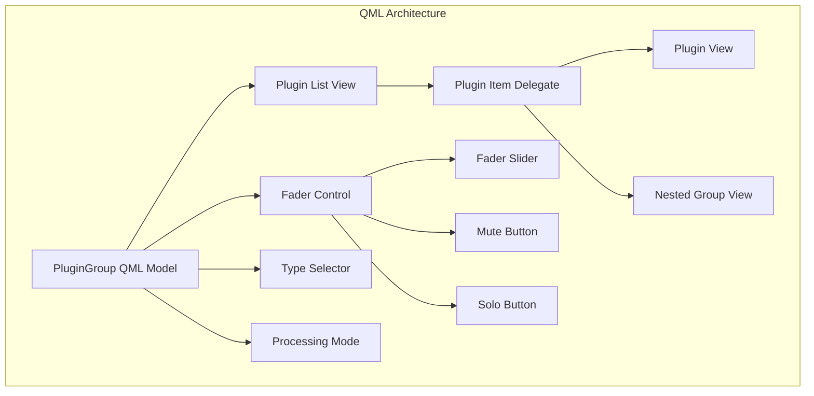

## Common Usage Patterns

### Simple Plugin with Fader
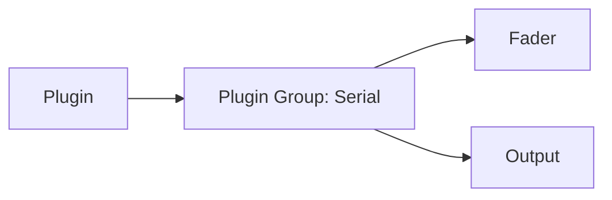

### Effect Chain
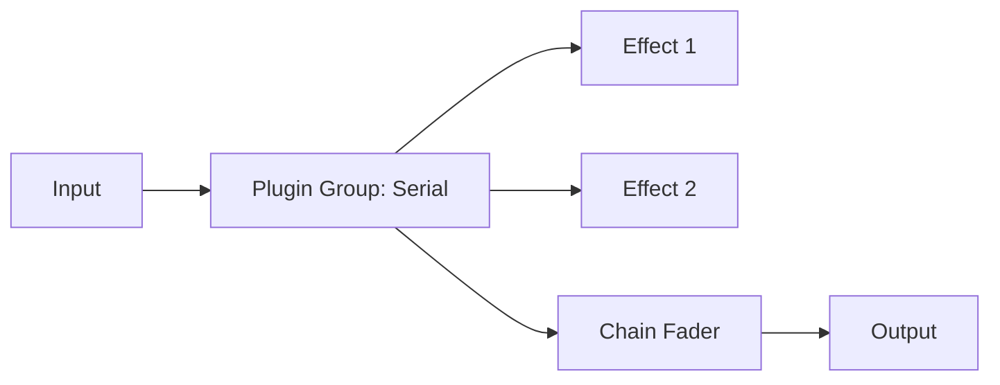

### Layered Instruments
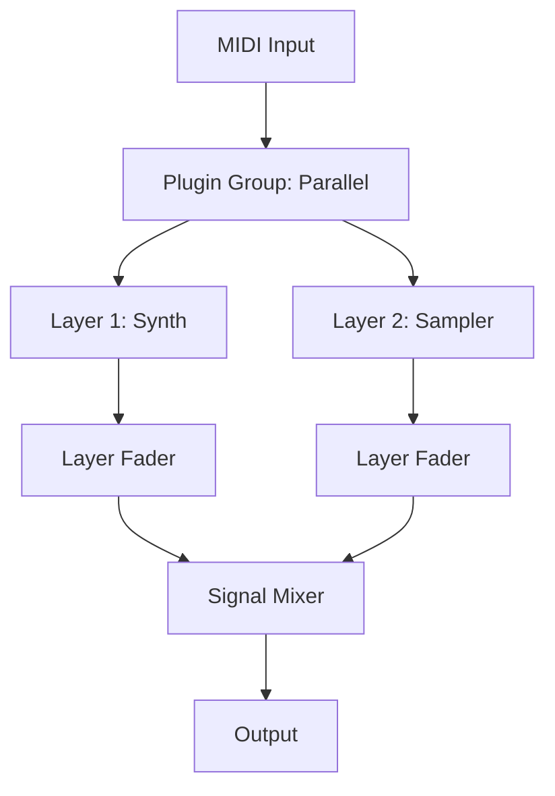

### Complex Nested Rack
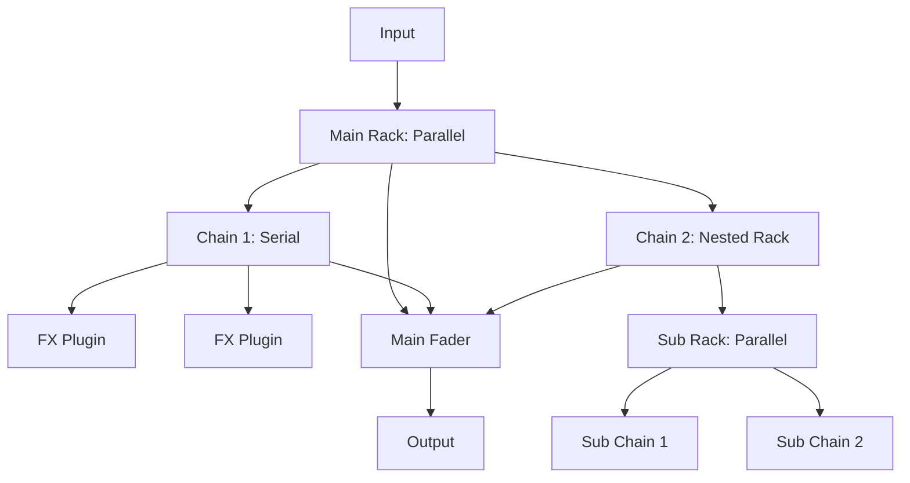

## Key Benefits

1. **Unified Abstraction**: Single concept covers all container use cases
2. **Recursive Nesting**: Arbitrary depth of nested groups
3. **Processing Flexibility**: Mixed serial/parallel modes
4. **Type Safety**: Clear separation of signal types
5. **Real-time Safety**: Thread-safe processing architecture
6. **UI Integration**: Seamless QML model/view separation

## Migration Strategy

### Phase 1: Basic Integration
- Replace existing plugin lists with Plugin Groups
- Maintain current functionality with single-plugin groups

### Phase 2: Advanced Features
- Implement nested groups
- Add UI for complex routing

### Phase 3: Optimization
- Performance tuning for complex nests
- Advanced UI features
