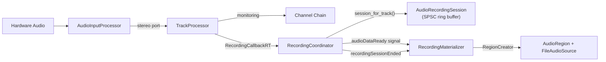
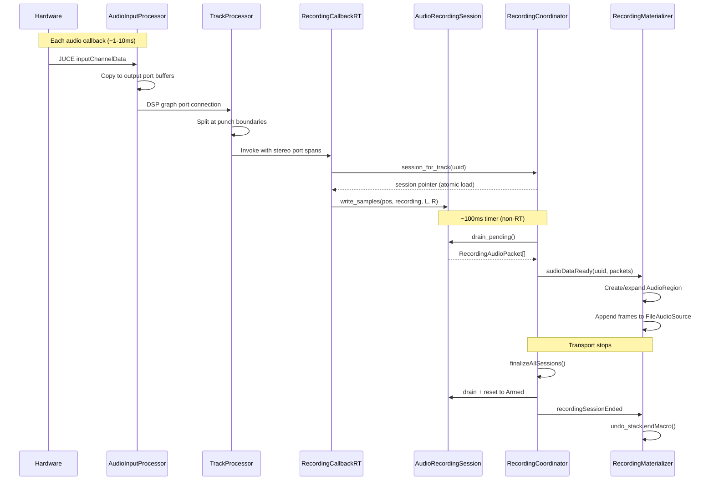
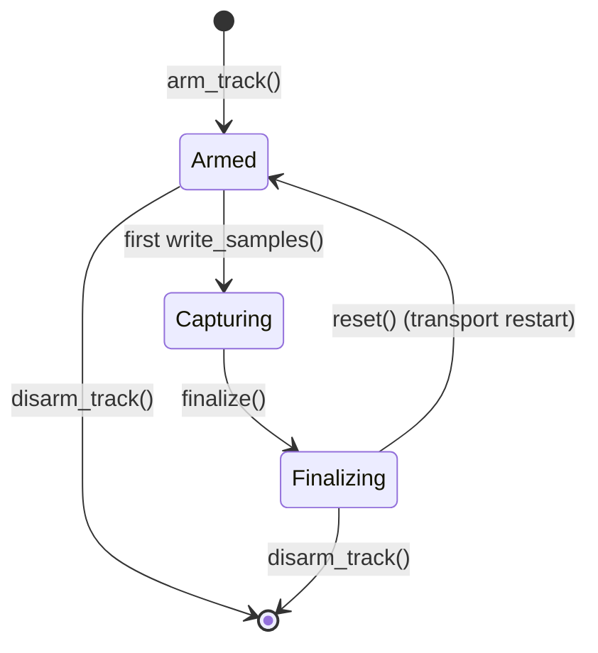

<!---
SPDX-FileCopyrightText: © 2026 Alexandros Theodotou <alex@zrythm.org>
SPDX-License-Identifier: FSFAP
-->

# Audio Recording Architecture

## Overview

Zrythm's recording pipeline captures audio from hardware inputs and materializes it into arrangement regions on armed tracks. The system is built around a clean RT/non-RT boundary: the audio thread writes into lock-free ring buffers with zero allocations, while a periodic timer on the main thread drains those buffers and creates undoable region objects.

## Component Map



| Component | Location | Thread | Responsibility |
|-----------|----------|--------|----------------|
| `AudioInputProcessor` | `src/dsp/` | RT | Bridges hardware audio into DSP graph ports |
| `TrackProcessor` | `src/structure/tracks/` | RT | Punch splitting, invokes recording callback |
| `RecordingCoordinator` | `src/controllers/` | Non-RT (timer + RT lookup) | Session lifecycle, RT snapshot, drains ring buffers |
| `AudioRecordingSession` | `src/controllers/` | RT write / Non-RT drain | Lock-free SPSC ring buffer per track |
| `RecordingMaterializer` | `src/controllers/` | Non-RT | Converts packets into AudioRegions with undo macros |
| `RecordingManager` | `src/engine/session/` | Legacy | Old MIDI/automation recording (kept for reference) |

## Data Flow



### Step-by-step

1. **Hardware capture**: The JUCE audio callback provides raw hardware input channel pointers. The `AudioEngine` stores these in `current_hw_input_` at the start of each callback.

2. **AudioInputProcessor**: A `ProcessorBase` node in the DSP graph. Its `InputDataProvider` lambda reads `current_hw_input_` (same thread, race-free) and copies the relevant channels into registered output ports. Creates one stereo port per channel pair and one mono port per individual channel.

3. **Graph routing**: `ProjectGraphBuilder` reads each track's `AudioInputSelection` (stored in `ProjectUiState`) and connects the matching `AudioInputProcessor` output port to the `TrackProcessor` stereo input port.

4. **TrackProcessor**: At the end of each `custom_process_block()`, if the transport is rolling, recording preroll has elapsed, the track has `Capabilities::Recording`, and the track is armed, it calls `handle_recording()`. This splits the block at punch in/out boundaries and invokes the `RecordingCallbackRT` for each valid range with the audio data from the input ports.

5. **RecordingCallbackRT**: A lambda installed by `ProjectSession`. Looks up the track's session via `coordinator->session_for_track(uuid)` (lock-free atomic snapshot read), then calls `session->write_samples()`.

6. **AudioRecordingSession::write_samples()**: RT-safe. Copies audio into a pre-allocated slot, pushes the slot index onto a `farbot::fifo` SPSC queue. If the fifo is full, the most recent slot is overwritten and a drop counter incremented. No allocations, no locks.

7. **RecordingCoordinator::process_pending()**: A 100ms `QTimer` drains all sessions. Calls `drain_pending()` on each, which pops slot indices from the SPSC fifo and copies data into `RecordingAudioPacket` objects. Emits `audioDataReady(track_id, packets)`.

8. **RecordingMaterializer**: Subscribes to `audioDataReady`. For each packet with `transport_recording == true`, either creates a new `AudioRegion` (via `RegionCreator` callback) or appends frames to the existing region's `FileAudioSource`. Detects timeline discontinuities to start new regions (e.g., at loop boundaries). All regions across all tracks within one recording take are wrapped in a single undo macro.

9. **Session finalization**: When transport stops, the coordinator's `finalizeAllSessions()` drains remaining data, emits a final `audioDataReady`, then emits `recordingSessionEnded`. The materializer closes the undo macro. Sessions are reset to `Armed` state (reusable), not destroyed.

## AudioInputSelection

Audio input routing is stored in `ProjectUiState`, not on the track itself. This is intentional: device names and channel indices are machine-specific and meaningless on another machine. Each selection maps a track UUID to a `(device_name, first_channel, stereo)` tuple. The graph builder resolves these to actual port connections at build time. Entries persist even when the device is unavailable (no connection made, no error).

## Monitoring

`TrackProcessor` has a `MonitorMode` parameter (`Off`, `On`, `Auto`):

- **Auto** (default): Pass input to output when armed, play back timeline when not armed
- **On**: Always pass input to output
- **Off**: Never pass input (rely on interface direct monitoring)

Monitored audio flows through the full channel chain (inserts, fader, sends) to the master output, so effects and routing work normally on the live input.

## Thread Safety

### RT / Non-RT Boundary

The central challenge is safely passing audio data from the RT audio thread to the non-RT main thread. Three mechanisms solve this:

| Mechanism | Purpose | Location |
|-----------|---------|----------|
| `std::atomic<Snapshot*>` | Lock-free session lookup from RT | `RecordingCoordinator::rt_snapshot_` |
| `farbot::fifo` SPSC | Lock-free, allocation-free audio data transfer | `AudioRecordingSession` |
| Two-phase deferred deletion | Safe snapshot lifecycle | `RecordingCoordinator` |

### Snapshot Pattern

The coordinator maintains a `std::atomic<Snapshot*>` — a heap-allocated `unordered_map<TrackUuid, Session*>`. RT threads read via `atomic load` (multiple concurrent readers from parallel DSP graph nodes). The non-RT thread publishes new snapshots via `atomic exchange` after arm/disarm operations.

Old snapshots go through two-phase deferred deletion:
1. `publish_snapshot()` pushes the old snapshot into `pending_snapshot_deletion_`
2. `process_pending()` (100ms later) moves those into `old_snapshots_`, destroying what was there previously

This guarantees retired snapshots survive at least 200ms — far longer than any audio callback duration.

### Session State Machine



State transitions use `std::atomic<State>`. `finalize()` is safe to call during active writes — it only sets a flag. In-flight writes complete normally; subsequent calls see `Finalizing` and skip.

## Undo Integration

One undo macro wraps an entire recording take across all tracks:

```
Transport record ON → beginMacro("Record")
  → AddArrangerObjectCommand (track A, region 1)
  → AddArrangerObjectCommand (track A, region 2, after loop)
  → AddArrangerObjectCommand (track B, region 1)
Transport record OFF → endMacro()
```

The macro lifecycle is driven by `RecordingCoordinator` signals, not inferred from packet content. The `recordingSessionEnded` signal is the sole trigger for `RecordingMaterializer::finalize_recording_macro()`. This prevents premature macro closure in multi-track scenarios.

## Punch Recording

`TrackProcessor::handle_recording()` splits each process block at punch in/out boundaries. Only the ranges falling within the punch window generate recording callbacks. The transport's `has_recording_preroll_frames_remaining()` gate ensures recording doesn't start until preroll (e.g., a 1-bar count-in) has elapsed.

## Extensibility

The architecture is designed to extend to MIDI and automation recording:

- **MIDI**: Add a `MidiInputProcessor` bridging hardware MIDI into the graph, plus a `MidiRecordingSession` with the same SPSC ring buffer pattern. The `RecordingCoordinator` can emit a `midiDataReady` signal alongside `audioDataReady`.
- **Automation**: An `AutomationRecordingSession` would capture parameter value changes with positions. Same coordinator and materializer patterns apply.
- **Scratch pad**: Packets with `transport_recording == false` are currently discarded at the materializer. Routing them to a scratch buffer instead enables always-record functionality without structural changes.

## Legacy System

The old `RecordingManager` (`src/engine/session/`) used an `MPMCQueue<RecordingEvent*>` with an `ObjectPool` for RT allocation avoidance. It handled MIDI notes, automation points, and audio in a single class with `std::binary_semaphore` synchronization. The new system decomposes this into focused components with cleaner thread contracts. The legacy code is kept for reference but not compiled into the active recording path.

## Key Source Files

| File | Description |
|------|-------------|
| `src/dsp/audio_input_processor.h` | Hardware audio bridge into DSP graph |
| `src/structure/tracks/track_processor.h` | Recording callback invocation and punch splitting |
| `src/controllers/recording_coordinator.h` | Session lifecycle orchestration and RT snapshot |
| `src/controllers/audio_recording_session.h` | Lock-free SPSC ring buffer per track |
| `src/controllers/recording_materializer.h` | Packet-to-region conversion with undo macros |
| `src/gui/backend/project_session.cpp` | Composition root: wires all components together |
| `src/engine/session/project_graph_builder.cpp` | Connects AudioInputProcessor outputs to track inputs |
| `src/structure/project/project_ui_state.h` | Stores per-track audio input selections |
| `tests/integration/audio_recording_pipeline_test.cpp` | End-to-end pipeline tests |
