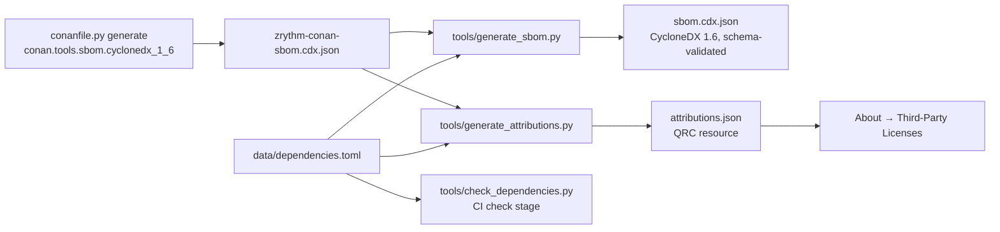

<!---
SPDX-FileCopyrightText: © 2026 Alexandros Theodotou <alex@zrythm.org>
SPDX-License-Identifier: FSFAP
-->

# Dependency Inventory, SBOM and Attribution

`data/dependencies.toml` is the single source of truth for every curated
third-party component Zrythm ships. It feeds two generators — a
schema-validated CycloneDX 1.6 SBOM (`sbom.cdx.json`, a build artifact) and
the in-app attribution display (About → Third-Party Licenses, bundled as a QRC
resource) — plus a drift checker that keeps the manifest in sync with the
build system and runs in CI, so the manifest can never silently go stale.
Versions of the Conan tier are not curated — they come from the resolved
dependency graph, captured by `conan.tools.sbom.cyclonedx_1_6` during
`conan install`. Direct conan entries still carry a curated `spdx` expression
for the attribution display (the SBOM uses the recipe's license); only
transitive components take their license from the graph.

Generation happens at CMake configure time (`cmake/DependencyInventory.cmake`,
included from the root `CMakeLists.txt` before `add_subdirectory(src)`), so
both outputs are always in the build directory after configuring. Rebuilding
after touching the manifest (or the generator scripts) re-triggers
configuration via `CMAKE_CONFIGURE_DEPENDS`.

## Manifest structure

Each `[[component]]` entry carries `id`, `name`, `tier` (`conan`, `cpm`,
`vendored`, `asset`), `spdx`, `copyright`, `homepage`, and:

- `shipped` (default `true`): whether the component reaches users. Build- and
  test-only tools (cmake, ninja, gtest, benchmark, …) are `shipped = false`.
- `version`: required for tier `cpm` (must match `package-lock.cmake`),
  forbidden for tier `conan` (comes from the resolved graph), optional
  otherwise.
- License texts are never duplicated: SPDX ids refer to `LICENSES/`
  (licenses also used by in-repo files, maintained for REUSE) or
  `data/licenses/` (runtime-only texts for external dependencies). Both
  directories are bundled into the QRC under `licenses/`, and every shipped
  component resolves to at least one full license text — the in-app display
  always shows the complete text (SPDX identifiers alone do not satisfy the
  licenses' distribution terms). `DocumentRef-COPYING` in the recipe license
  string of the transitive dbus component (pulled in via qt) is not a
  license id and has no text; the remaining ids of its expression are
  bundled.

Conan transitive dependencies need no manifest entries: the SBOM receives the
full graph from the fragment, and the attribution generator appends them
automatically with a `via` pointer to the nearest direct require (e.g.
`serd`, `sord`, `sratom` appear as "via lilv").

## Adding or bumping a dependency

1. Add the dependency the normal way (`conanfile.py`, `package-lock.cmake`
   or `ext/`).
2. Add or update its entry in `data/dependencies.toml` (version rules per
   tier as above).
3. Run `python3 tools/check_dependencies.py` — it must print `OK`. The drift
   checker flags both missing entries and stale ones.
4. Add the license text via
   `reuse download -o data/licenses/<id>.txt <id>` — or into `LICENSES/` if
   some in-repo file also carries that license (then commit it as part of the
   REUSE set).
5. Reconfigure (`cmake --preset default`) to regenerate `attributions.json`
   and `sbom.cdx.json`.

## CI

`check:dependency-inventory` (check stage) runs the python tool tests and the
drift checker, and gates the GNU/Linux build job. The dedicated
`sbom:gnu/linux` job generates the Release `sbom.cdx.json` from the
configure-time Conan fragment and publishes it as a pipeline artifact,
independently of the build job (so the SBOM is available even when the build
fails).

## Notes

- `REUSE.toml` and `LICENSES/` remain the file-level repo licensing data for
  REUSE compliance; these tools only read license texts from those
  directories and are not consumers of the REUSE annotations themselves.
- Configure with the repo venv active so `find_package(Python3)` resolves
  the venv interpreter (needed for SBOM schema validation). If a build
  directory was first configured without the venv, delete the stale
  `_Python3_EXECUTABLE` entry from `CMakeCache.txt` or wipe the build
  directory; otherwise SBOM generation degrades to a configure-time warning
  (attribution generation needs only the stdlib and still works).
- The Conan SBOM fragment API (`conan.tools.sbom.cyclonedx_1_6`) is
  experimental; its only call site is `conanfile.py generate()`.
