<!---
SPDX-FileCopyrightText: © 2025 Alexandros Theodotou <alex@zrythm.org>
SPDX-License-Identifier: CC-BY-SA-4.0
-->

# Scenes System Architecture

## Overview

This document outlines the architecture for Zrythm's scenes system, which provides clip launching functionality. The system integrates seamlessly with Zrythm's existing architecture while providing professional-grade clip launching capabilities.

## Architecture Overview

The scenes system is organized into several key components that work together to provide clip launching functionality:

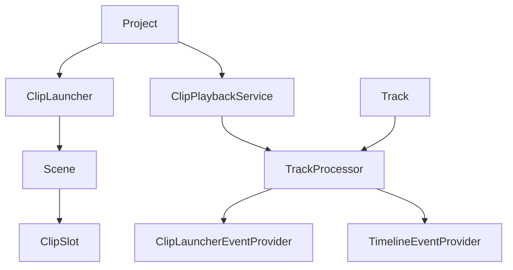

### Key Components

1. **Project**: Owns the global ClipLauncher and ClipPlaybackService instances
2. **ClipLauncher**: Manages scenes and clip slots (UI/data layer)
3. **ClipPlaybackService**: Handles all clip playback operations (service layer)
4. **Scene**: Represents a vertical column of clips
5. **ClipSlot**: Contains a region and manages clip state
6. **TrackProcessor**: Manages playback modes and event providers
7. **ClipLauncherEventProvider**: Handles clip-specific MIDI and audio event processing
8. **TimelineEventProvider**: Handles timeline-specific MIDI and audio event processing

## Service-Based Architecture

The system uses a service-based approach where the ClipPlaybackService handles all playback operations, providing a clean separation between the UI layer and the audio engine.

### Service Layer Benefits

- **Realtime Safety**: The service manages state transitions without blocking the audio thread
- **Centralized Logic**: All clip playback logic is centralized in one place
- **Testability**: The service can be easily mocked for testing
- **Flexibility**: Multiple UI components can use the same service

## Playback Mode Management

Tracks can operate in two distinct playback modes:

- **Timeline Mode**: Uses regions from the timeline arrangement
- **Clip Launcher Mode**: Uses regions from clip launcher scenes

The TrackProcessor manages switching between these modes by activating/deactivating the appropriate event providers.

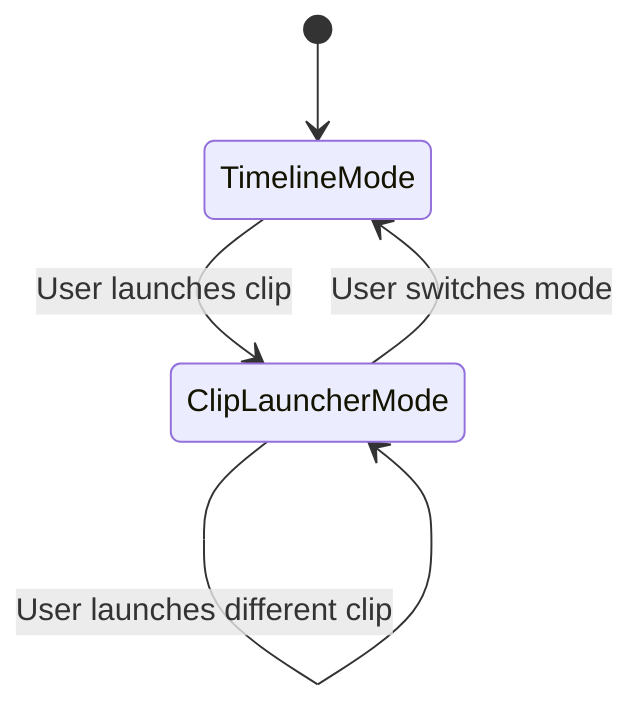

## User Interface Architecture

### Clip Launcher View Layout

The clip launcher is displayed as a grid with tracks as rows and scenes as columns:

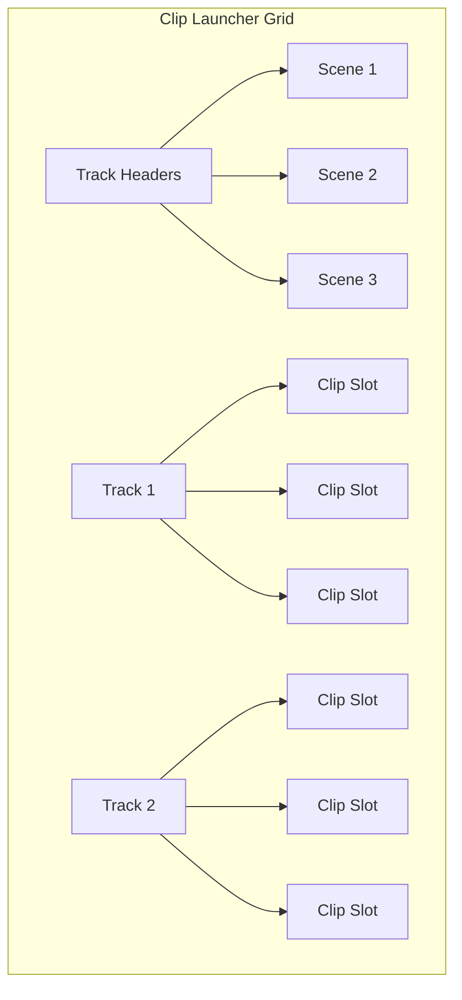

### View Toggle System

The interface supports toggling between Timeline and Clip Launcher views:

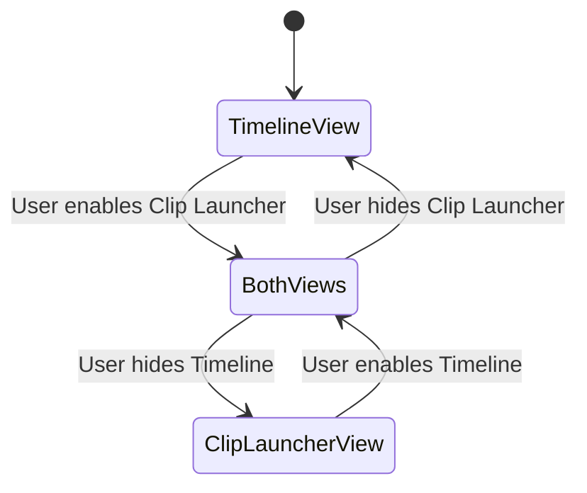

## Clip Launching Flow

### State Management

The system uses a timer-based approach to monitor playback state changes, ensuring realtime safety:

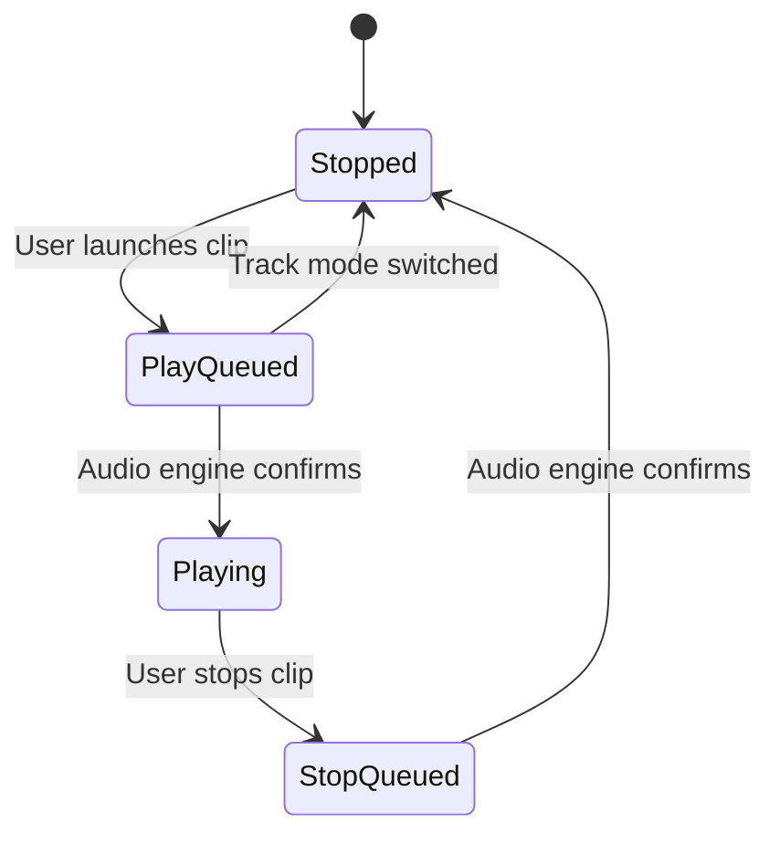

### Quantization System

Clips can be launched with various quantization options to ensure musical timing:

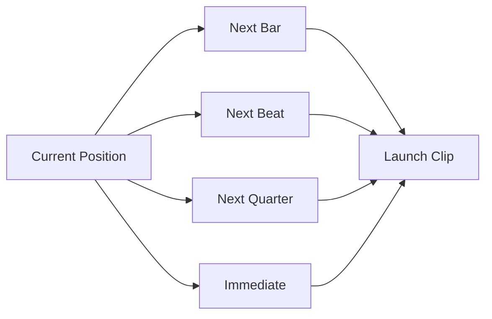

## Event Processing Architecture

### Provider System

The TrackProcessor uses a flexible provider system to handle different playback modes:

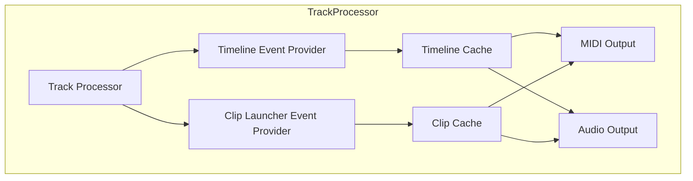

### Thread-Safe State Management

The system uses lock-free structures to ensure thread safety between the UI and audio threads:

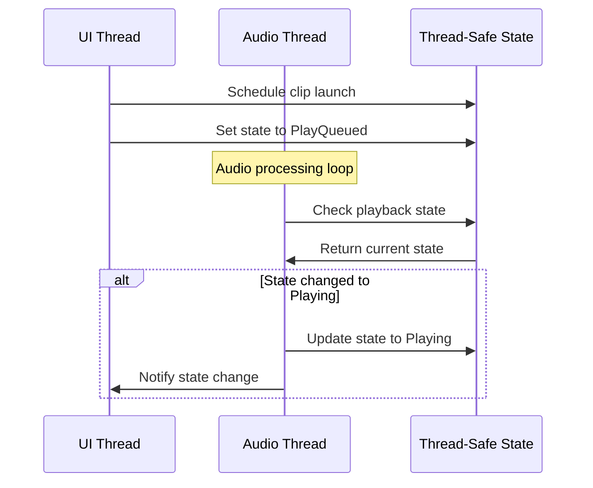

## Clip Playback Service

### Service Responsibilities

The ClipPlaybackService handles all clip playback operations, providing a clean interface between the UI and the audio engine:

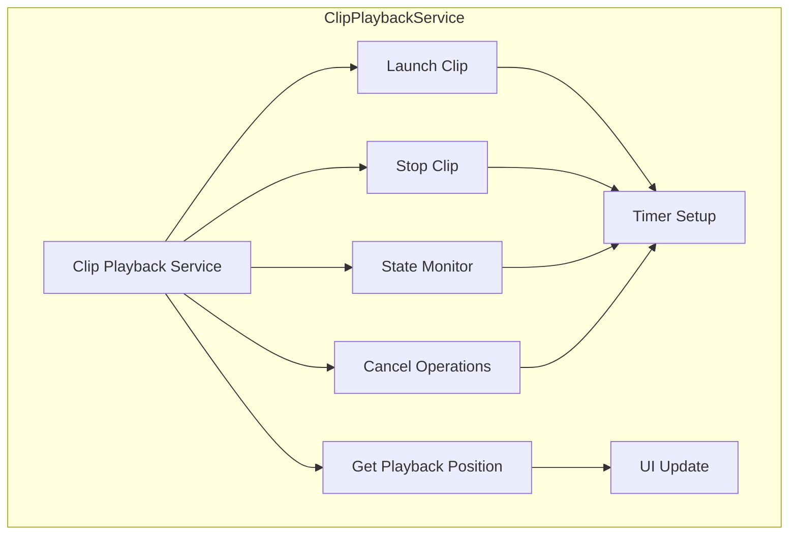

### State Monitoring

The service uses timers to monitor playback state changes without blocking the audio thread:

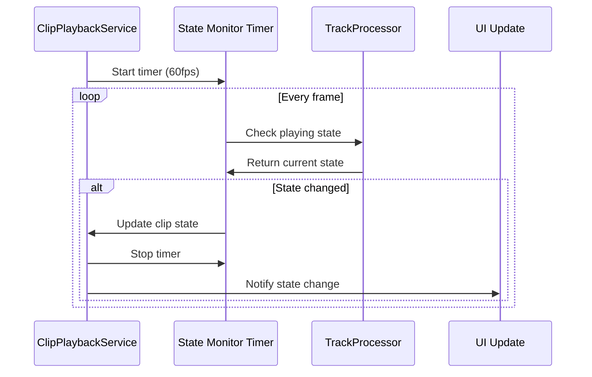

### Mode Switching

When a track is switched to timeline mode, the service cancels any pending clip operations:

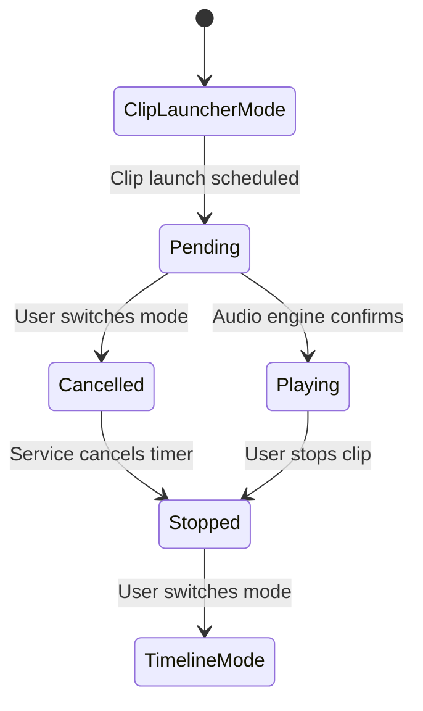

## Clip Caching Strategy

### Position-Independent Caching with Transport Awareness

The system uses position-independent caching to allow clips to start at any position and loop continuously, with special handling for transport position changes:

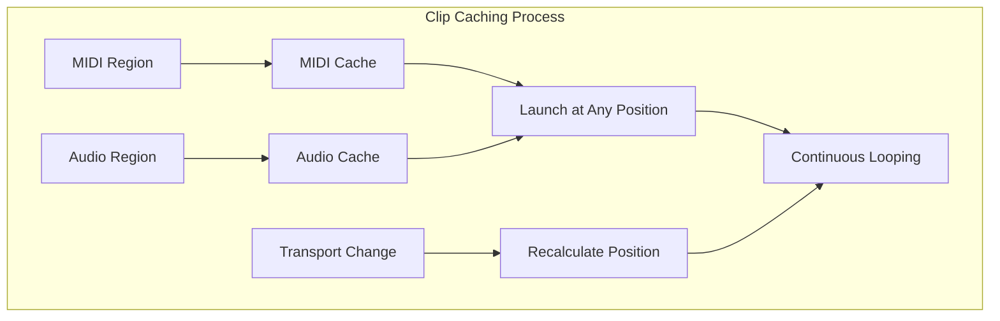

### Cache Generation Flow

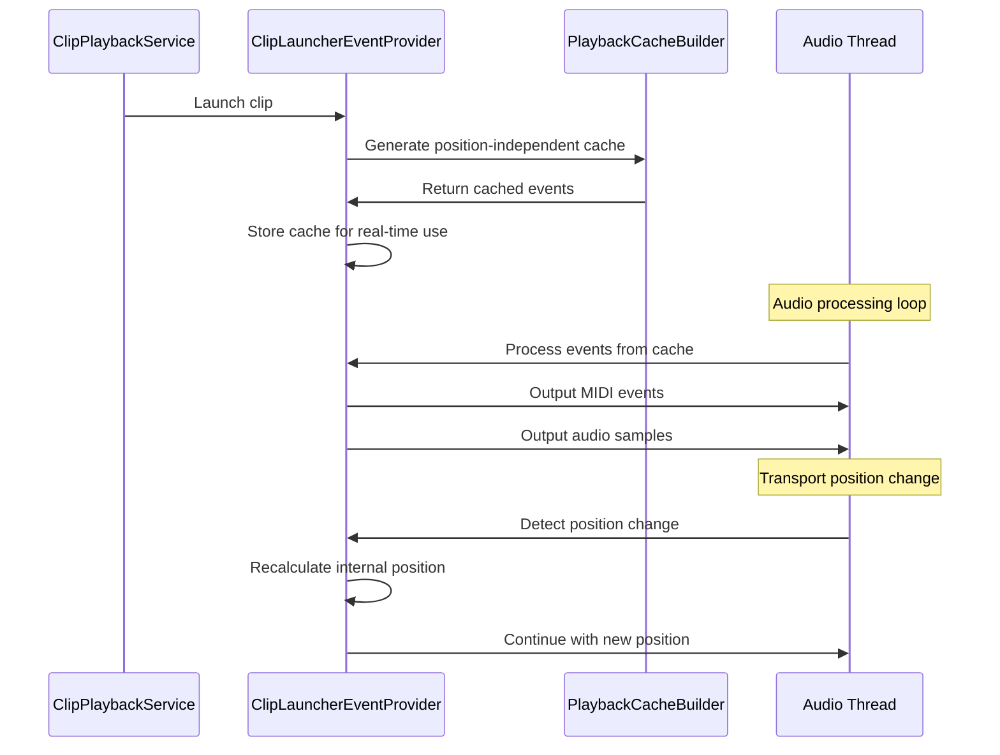

### Transport Position Handling

The ClipLauncherEventProvider tracks timeline position changes and recalculates the internal buffer position accordingly for both MIDI and audio. It also handles transport state transitions to prevent hanging notes:

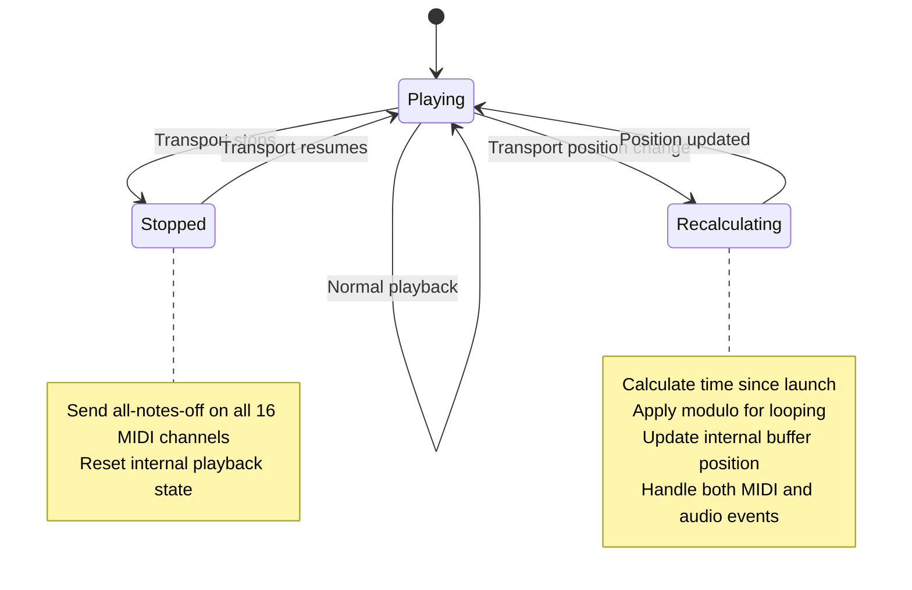

## Integration with Audio Engine

### DSP Graph Integration

The TrackProcessor is already part of the DSP graph, so no new nodes are needed. Each TrackProcessor delegates to active event providers during audio processing:

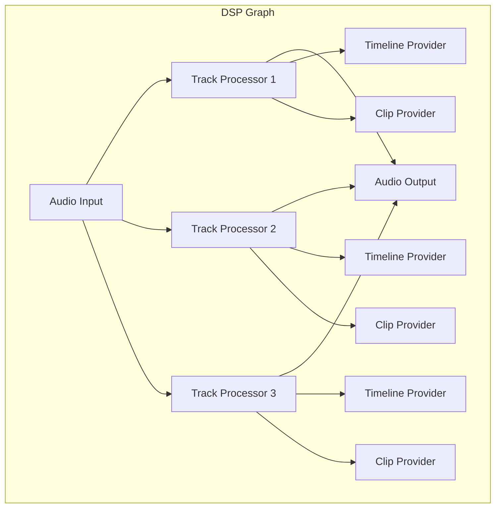

### Realtime-Safe Operations

The system ensures realtime safety by:

1. **Lock-free State Updates**: Using atomic operations for state changes
2. **Timer-based Monitoring**: Avoiding blocking calls in the audio thread
3. **Cache Swapping**: Using thread-safe cache swapping mechanisms
4. **Non-blocking Operations**: All operations that might block are performed outside the audio thread
5. **Transport Position Tracking**: Efficient tracking of timeline position changes without blocking
6. **Unified Event Processing**: Both MIDI and audio events use the same thread-safe caching mechanisms
7. **Transport State Transitions**: Detect when transport stops/starts and send appropriate MIDI messages (all-notes-off)
8. **Buffer Management**: Providers add to buffers while TrackProcessor handles clearing at cycle boundaries

## Data Serialization

### Project Format

The clip launcher data is serialized as part of the project file:

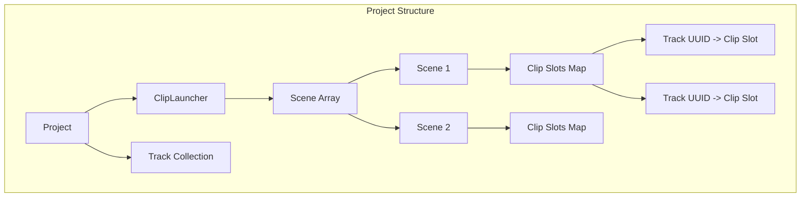

## Future Enhancements

### Planned Features

1. **Follow Actions**: Configure what happens after a clip finishes
2. **Scene Launch Quantization**: Different quantization options for scene launches
3. **Clip Envelopes**: Volume and effect envelopes for clips
4. **MIDI Mapping**: MIDI controls for clip launching
5. **Clip Recording**: Record clips directly into the clip launcher
6. **Playback Position Visualization**: Enhanced visual feedback for clip playback
7. **Audio Clip Warping**: Time-stretching and pitch-shifting for audio clips

### Architecture Extensibility

The service-based architecture makes it easy to add new features:

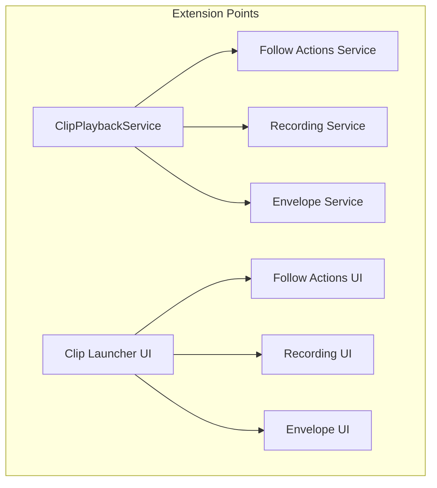

## Benefits of This Architecture

1. **Realtime Safety**: Timer-based monitoring prevents audio thread blocking
2. **Clean Separation**: Service layer separates UI from audio engine
3. **Testability**: Services can be easily mocked for testing
4. **Flexibility**: Multiple providers can be active simultaneously
5. **Maintainability**: Clear boundaries between components
6. **Extensibility**: Easy to add new features without affecting existing code
7. **Performance**: Efficient caching and event processing for both MIDI and audio
8. **User Experience**: Professional-grade clip launching with quantization
9. **Unified Processing**: Consistent handling of MIDI and audio events across the system
10. **Audio Quality**: High-fidelity audio playback with proper caching and real-time processing

This architecture provides a solid foundation for a professional-grade scenes system that integrates seamlessly with Zrythm's existing architecture while providing the flexibility and power users expect from modern DAWs. The unified approach to MIDI and audio event processing ensures consistent behavior and high performance across all clip types.
