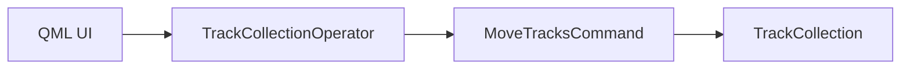
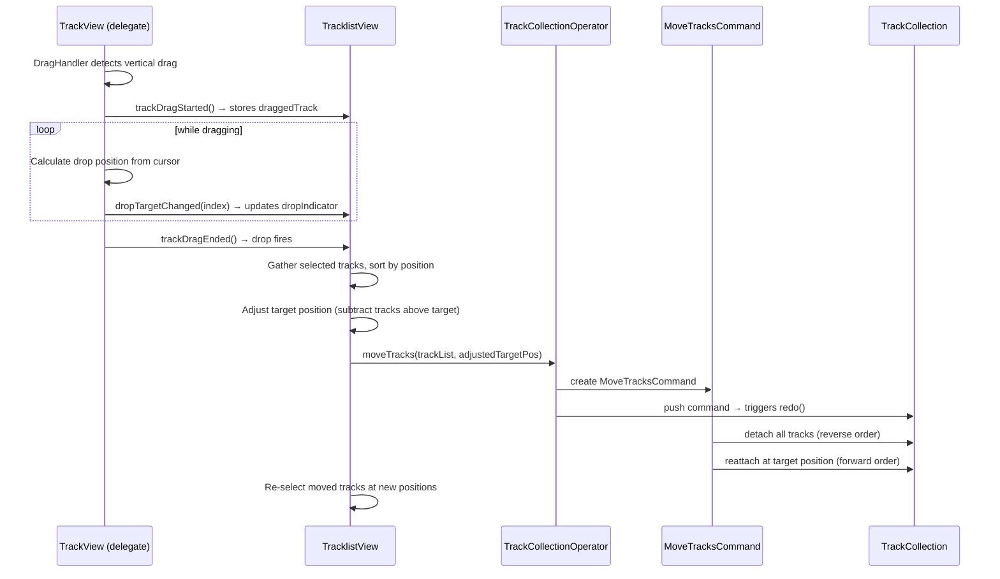
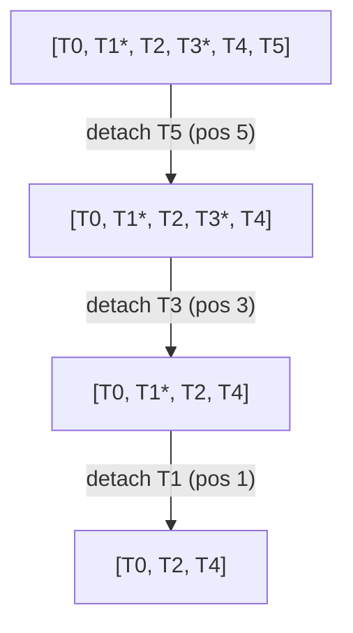
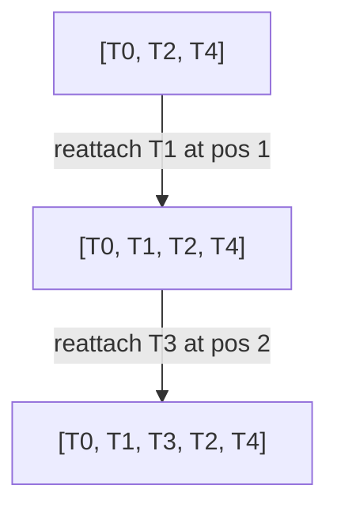

<!---
SPDX-FileCopyrightText: © 2026 Alexandros Theodotou <alex@zrythm.org>
SPDX-License-Identifier: FSFAP
-->

# Track Moving Architecture

This document describes how track reordering works end-to-end, from the QML
drag-and-drop interaction through the undo/redo command layer to the
`TrackCollection` model mutations.

## Module Map

The feature spans four layers following the project's
[undo system](undo_system.md) architecture:



| Layer | Component | Responsibility |
|---|---|---|
| UI | `TrackView.qml`, `TracklistView.qml` | Drag detection, drop indicator, target position calculation |
| Operator | `TrackCollectionOperator` | QML-callable facade; converts `Track*` to `TrackUuidReference`, pushes command |
| Command | `MoveTracksCommand` | `QUndoCommand` subclass; two-phase detach/reattach with undo support |
| Model | `TrackCollection` | `detach_track()` / `reattach_track()` — model mutations that preserve folder metadata |

## Drag-and-Drop Flow (QML)



### Target Position Calculation

The drop target index reported by each delegate is an index into the **full**
`TrackCollection` (not the filtered ListView). When the user drops tracks, the
QML layer adjusts the target position to account for selected tracks that sit
above the drop point — removing those tracks shifts everything below them up:

```javascript
let aboveCount = tracksToMove.filter(e => e.pos < targetPos).length;
targetPos -= aboveCount;
```

For pinned/non-pinned boundary handling, `TracklistView` offsets indices:
- **Pinned list**: delegate `trackIndex` = `ListView index` directly
- **Non-pinned list**: delegate `trackIndex` = `ListView index + pinnedTracksCutoff`

### Drop Indicators

Each `TrackView` delegate renders two indicator rectangles:

- **Top indicator**: shown when `dropTargetIndex === trackIndex` (drop above this track)
- **Bottom indicator**: shown on the **last** delegate when `dropTargetIndex === trackIndex + 1` (drop past the end)

## MoveTracksCommand

### Construction

Stores the track references (in their current order) and their original
positions. The `target_position_` is the index where the **first** moved track
should land after the remaining tracks are compacted.

### redo() — Two-Phase Detach/Reattach

The command uses a two-phase approach instead of sequential `move_track()` calls.
Sequential moves cause index-shifting bugs when moving non-contiguous tracks
(e.g., tracks at positions 1 and 3 to position 2 can interleave an unselected
track between them).

**Phase 1 — Detach all selected tracks** (in reverse position order):



Removing in reverse order ensures earlier indices remain stable.

**Phase 2 — Reattach at target position** (in original relative order):



Each reattach increments the insert position, so moved tracks land contiguously.

### undo() — Reverse the Operation

Same two-phase approach, but detaches from current positions and reattaches at
the stored original positions. Original positions are sorted in forward order
for reattachment.

## Folder Metadata Preservation

### The Problem

`TrackCollection` stores two pieces of folder metadata:

| Data Structure | Type | Purpose |
|---|---|---|
| `expanded_tracks_` | `unordered_set<Uuid>` | Which foldable tracks are expanded |
| `folder_parent_` | `unordered_map<Uuid, Uuid>` | Maps each child to its folder parent |

The standard `remove_track()` clears both of these for the removed track (and
all its children). The standard `insert_track()` auto-expands foldable tracks.
Using these during a move would destroy folder metadata.

### The Solution: detach/reattach

`TrackCollection` provides two metadata-preserving alternatives:

- **`detach_track(uuid)`** — Removes the track from the `tracks_` vector and
  emits proper Qt model signals (`beginRemoveRows`/`endRemoveRows`), but
  intentionally does **not** clear `expanded_tracks_` or `folder_parent_`.
  Solo/mute/listen signal disconnections still happen via the
  `rowsAboutToBeRemoved` handler.

- **`reattach_track(ref, pos)`** — Inserts the track and emits
  `beginInsertRows`/`endInsertRows`, but does **not** auto-expand foldable
  tracks or modify `folder_parent_`. Solo/mute/listen signal reconnections
  happen via the `rowsInserted` handler.

This ensures that a detach-then-reattach cycle preserves all folder metadata
while still maintaining correct Qt model signal semantics for the UI.
