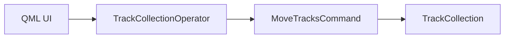
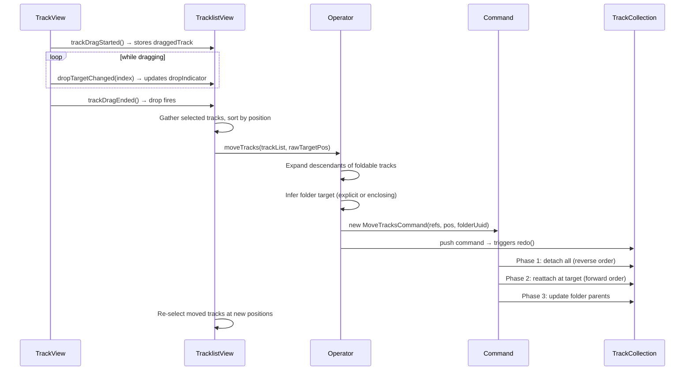

<!---
SPDX-FileCopyrightText: © 2026 Alexandros Theodotou <alex@zrythm.org>
SPDX-License-Identifier: FSFAP
-->

# Track Moving Architecture

This document describes how track reordering works end-to-end, from the QML
drag-and-drop interaction through the undo/redo command layer to the
`TrackCollection` model mutations, including folder parent relationship
management.

## Module Map



| Layer | Component | Responsibility |
|---|---|---|
| UI | `TrackView.qml`, `TracklistView.qml` | Drag detection, drop indicator, target position |
| Operator | `TrackCollectionOperator` | Expands descendants, infers folder target, converts `Track*` to refs, pushes command |
| Command | `MoveTracksCommand` | `QUndoCommand` subclass; three-phase detach/reattach/reparent with undo |
| Model | `TrackCollection` | `detach_track()` / `reattach_track()`, `set_folder_parent()` / `remove_folder_parent()` |

## Drag-and-Drop Flow



### Target Position

The drop target index is an index into the full `TrackCollection` (not the
filtered ListView). The QML layer passes this raw pre-removal index directly to
`moveTracks()`. The command adjusts internally during `redo()` by subtracting
the number of moved tracks that sit above the target:

```cpp
const auto above_count = std::ranges::count_if(
    current_positions,
    [this](int pos) { return pos < target_position_; });
int insert_pos = target_position_ - static_cast<int>(above_count);
```

### Drop Indicators

Each `TrackView` delegate renders two indicator rectangles:
- **Top indicator**: shown when `dropTargetIndex === trackIndex` (drop above)
- **Bottom indicator**: shown on the last delegate when
  `dropTargetIndex === trackIndex + 1` (drop past the end)

## TrackCollectionOperator

### Descendant Expansion

When the user selects a folder track, its descendants must move with it. The
operator auto-expands the selection using `get_all_descendants()`, preserving
list order and deduplicating.

### Folder Target Inference

The operator determines the target folder by priority:

1. **Explicit** — QML passes a `targetFolder` argument (validated as foldable)
2. **Inferred** — `get_enclosing_folder(targetPosition)` checks whether the
   drop position falls inside an expanded folder's child range
3. **None** — `nullopt`, meaning external folder parents are cleared

## MoveTracksCommand

### Construction

Stores original positions, original folder parents, and the target folder's
expanded state for undo. A `moved_uuids_` set provides O(1) lookup to
distinguish internal from external folder relationships.

### redo() — Three Phases

**Phase 1 — Detach** all tracks in reverse position order (indices stay stable).

**Phase 2 — Reattach** at the target position in original relative order (tracks
land contiguously, insert position increments for each).

**Phase 3 — Update folder parents.** The command distinguishes:

| Type | Description | Treatment |
|---|---|---|
| Internal | Parent is also in the moved set | Preserved — never modified |
| External | Parent is outside the moved set (or nullopt) | Cleared, then optionally set to target folder |

Key behaviors in Phase 3:
- **Circular nesting prevention**: if the target folder is a descendant of any
  moved track, all folder updates are skipped
- **Auto-expand**: moving into a collapsed folder auto-expands it

### undo()

Same three-phase approach in reverse: detach from current positions, reattach
at stored original positions, then restore original folder parents for
externally-parented tracks and the target folder's expanded state.

## Folder Metadata Preservation

`TrackCollection` stores folder metadata in `expanded_tracks_` and
`folder_parent_`. The standard `remove_track()` / `insert_track()` would
destroy this during a move.

### detach/reattach

`detach_track()` and `reattach_track()` are metadata-preserving alternatives
that emit proper Qt model signals but do not touch `expanded_tracks_` or
`folder_parent_`. A detach-reattach cycle preserves all folder metadata.

### Folder Parent API

`set_folder_parent()` and `remove_folder_parent()` accept an `auto_reposition`
parameter (default `false`):

- **`false`**: Only updates the `folder_parent_` map — the caller handles
  positioning (used by the command, which positions via detach/reattach)
- **`true`**: Updates the map *and* auto-moves the track within the folder's
  child range (used by higher-level callers)
