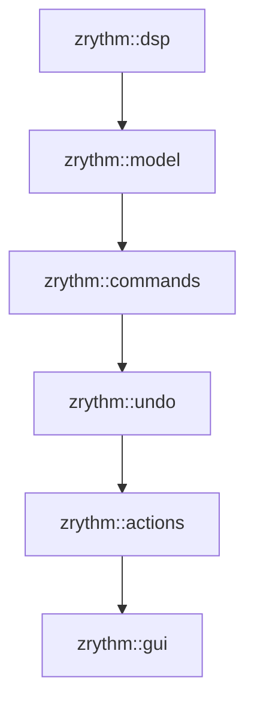
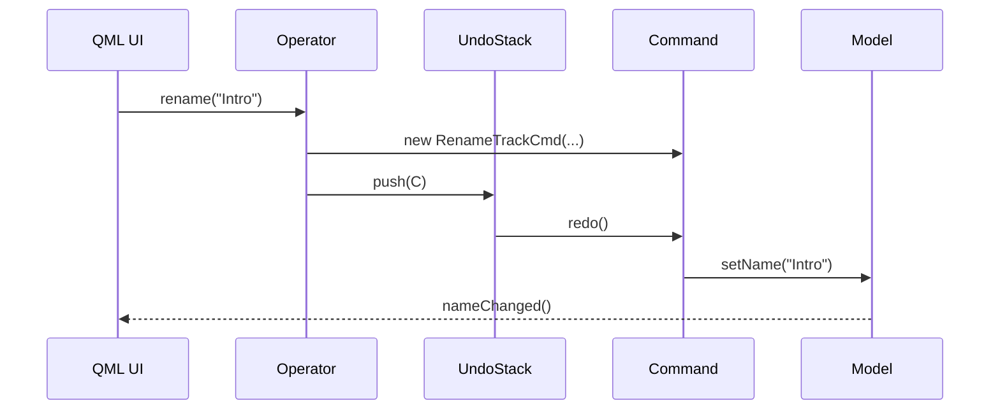

<!---
SPDX-FileCopyrightText: © 2025 Alexandros Theodotou <alex@zrythm.org>
SPDX-License-Identifier: FSFAP
-->

# Zrythm Undo Architecture

## 1. Guiding Principles
- **Separation of Concerns**:
  - Model layer: pure data & properties, no undo awareness.
  - Commands: immutable, reversible single-concern mutations.
  - Undo-Stack: owns commands, persistence, global hooks.
  - Actions (Operators): thin, stateless façade that only produces commands.
  - UI (QML): declarative views that use operators to edit values, zero direct model mutation.

- **No global state**: one undo-stack per project, exposed via standard QML type registration.

- **Tooling-friendly**: no root-context properties, no singletons.

---

## 2. Module Map & Dependencies


| Module        | Responsibility                                | Public API Examples |
|---------------|-----------------------------------------------|---------------------|
| `zrythm::dsp`    | Low-level DSP types & processor graphs        | `ProcessorParameter` |
| `zrythm::model`  | Data objects (`Track`, `Clip`, `Plugin`)      | `Track::setName()`  |
| `zrythm::commands` | Concrete `QUndoCommand` subclasses          | `RenameTrackCmd`    |
| `zrythm::undo`   | Undo-stack container, save/load, hooks        | `UndoStack` QML type|
| `zrythm::actions` | Controllers that expose semantic actions   | `TrackOperator::rename()` |
| `zrythm::gui`    | Qt-Quick UI, makes changes via operators      | `TrackView.qml`     |

---

## 3. Typical Edit Flow (Sequence Diagram)


---

## 4. QML Integration Pattern
```qml
// TrackView.qml
import Zrythm

required property UndoStack projectUndo
required property Track currentTrack

TrackOperator {
    id: trackOp
    track:   currentTrack
    undoStack: projectUndo
}

TextField {
    text: trackOp.track.name
    onEditingFinished: trackOp.rename(text)
}
```

---

## 5. Checklist for New Undoable Action
1. Add **model setter** (if not present).
2. Add **command class** in `zrythm::commands`.
3. Implement **operator method** in `zrythm::actions`.
4. Register new command for (de)serialization.
5. Add unit tests for the command + operator.
6. Expose operator to QML **only if UI needs it**.

---

## 6. Non-Undoable State
- View-only flags (visibility, window geometry) bypass operators; mutate model or view-model directly.

---
