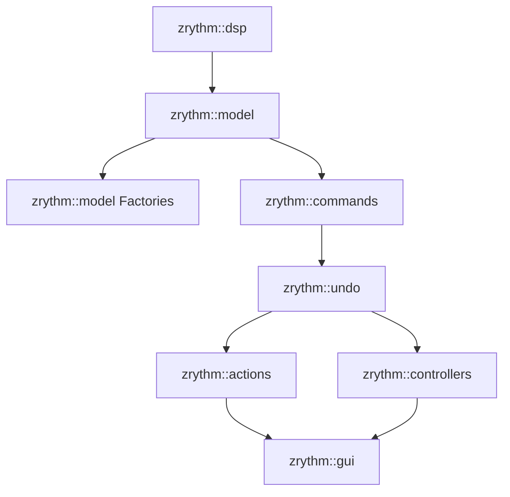
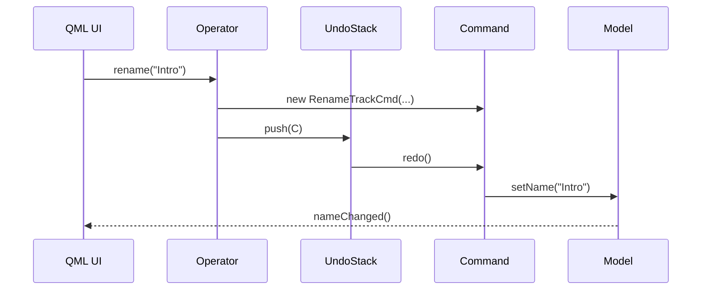
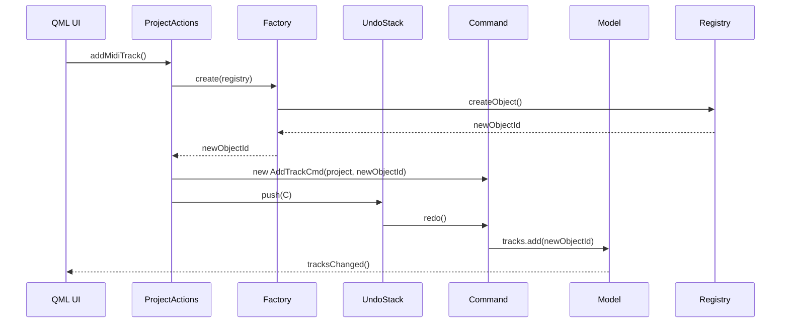

<!---
SPDX-FileCopyrightText: © 2025 Alexandros Theodotou <alex@zrythm.org>
SPDX-License-Identifier: FSFAP
-->

# Zrythm Undo/Redo Architecture

## 1. Guiding Principles
- **Separation of Concerns**:
  - Model layer: pure data & properties, no undo awareness.
  - Commands: immutable, reversible single-concern mutations.
  - Undo-Stack: owns commands, persistence, global hooks.
  - Actions (Operators): thin, stateless façade that only produces commands.
  - Controllers: QML-facing orchestrators for non-undoable operations (e.g., transport navigation, project save/load).
  - UI (QML): declarative views that use operators to edit values, zero direct model mutation.
  - Factories: handle creation and initialization of model objects.

- **No global state**: one undo-stack per project, exposed via standard QML type registration.

- **Tooling-friendly**: no root-context properties, no singletons.

---

## 2. Module Map & Dependencies


| Module        | Responsibility                                | Public API Examples |
|---------------|-----------------------------------------------|---------------------|
| `zrythm::dsp`    | Low-level DSP types & processor graphs        | `ProcessorParameter` |
| `zrythm::model`  | Data objects (`Track`, `Clip`, `Plugin`)      | `Track::setName()`  |
| `zrythm::model::Factories` | Object creation & initialization        | `TrackFactory::create()` |
| `zrythm::commands` | Concrete `QUndoCommand` subclasses          | `RenameTrackCmd`, `AddTrackCmd` |
| `zrythm::undo`   | Undo-stack container, save/load, hooks        | `UndoStack` QML type|
| `zrythm::actions` | Controllers that produce commands for undoable operations | `TrackOperator::rename()`, `ProjectActions.addMidiTrack()` |
| `zrythm::controllers` | Controllers for non-undoable operations (navigation, save/load) | `TransportController::moveForward()` |
| `zrythm::gui`    | Qt-Quick UI, makes changes via operators      | `TrackView.qml`     |

---

## 3. Architecture Overview

The architecture supports two primary operations:
1. **Editing existing objects** via Operator classes (stateful, per-object)
2. **Adding new objects** via Action functions (stateless, global)

### Object Editing Flow


### Object Creation Flow


---

## 4. Component Responsibilities

### Models (`zrythm::model`)
- Represent the persistent state of the application
- Contain business logic and data (Track, Clip, Project, etc.)
- All instances owned by a central Registry with unique, reference-counted IDs
- No knowledge of undo/redo systems or UI

### Factories (`zrythm::model`)
- Handle creation and initial configuration of model objects
- Reside alongside the model classes they create
- Assign unique IDs from the Registry
- Set up default state and internal connections

### Commands (`zrythm::commands`)
- Perform single, reversible operations on models
- Derive from `QUndoCommand`
- Implement `redo()` (apply change) and `undo()` (revert change)
- Dumb and focused - know how to apply/revert changes but not why

### Actions (`zrythm::actions`)
Two types of actions:
1. **Operators**: Stateful, per-object actions for editing (e.g., `TrackOperator`)
2. **Global Actions**: Stateless functions for object creation (e.g., `ProjectActions.addMidiTrack()`)

Responsibilities:
- Provide high-level, QML-friendly API for undoable operations
- Orchestrate complex operations (potentially multiple commands)
- Use Factories to create new objects
- **Create Commands and push to UndoStack** (key distinction from Controllers)

### Controllers (`zrythm::controllers`)
QML-facing orchestrators for operations that don't require undo/redo:

Responsibilities:
- Provide high-level, QML-friendly API for non-undoable operations
- Handle navigation (e.g., playhead movement with `TransportController`)
- Orchestrate project save/load
- May read/serialize undo state but **never produce commands**

### Undo Stack (`zrythm::undo`)
- Owns and manages command lifecycle
- Handles persistence and serialization
- Provides global hooks for undo/redo events
- Exposed as QML type for UI integration

### Controllers (`zrythm::controllers`)
QML-facing orchestrators for operations that don't require undo:

Responsibilities:
- Provide high-level, QML-friendly API for non-undoable operations
- Handle navigation (e.g., playhead movement)
- Orchestrate project save/load (may read/serialize undo state)
- Direct model manipulation for ephemeral UI state

Key distinction from Actions:
- **Actions** produce commands and push to UndoStack
- **Controllers** never produce commands (may read/serialize undo state but don't modify it)

---

## 5. QML Integration Patterns

### Editing Existing Objects
```qml
// TrackView.qml
import Zrythm 1.0

required property UndoStack projectUndo
required property Track currentTrack

TrackOperator {
    id: trackOp
    track: currentTrack
    undoStack: projectUndo
}

TextField {
    text: trackOp.track.name
    onEditingFinished: trackOp.rename(text)
}
```

### Adding New Objects
```qml
// ProjectToolbar.qml
import Zrythm 1.0

required property UndoStack projectUndo

Button {
    text: "Add MIDI Track"
    onClicked: ProjectActions.addMidiTrack(projectUndo)
}
```

---

## 6. Checklist for New Undoable Action

### For Editing Existing Objects:
1. Add model setter (if not present)
2. Add command class in `zrythm::commands`
3. Implement operator method in `zrythm::actions`
4. Register command for (de)serialization
5. Add unit tests for command + operator
6. Expose operator to QML if UI needs it

### For Adding New Objects:
1. Add factory class in `zrythm::model::Factories`
2. Add command class in `zrythm::commands`
3. Implement action function in `zrythm::actions`
4. Register command for (de)serialization
5. Add unit tests for factory, command and action
6. Expose action to QML

---

## 7. Non-Undoable State
- View-only flags (visibility, window geometry) bypass operators; mutate model or view-model directly.
- Transport navigation (playhead movement) uses Controllers instead of Actions.
- Project save/load operations use Controllers (may serialize undo state but don't produce commands).

---

## 8. Key Design Principles

1. **Single Responsibility**: Each component has a clear, distinct purpose
2. **Separation of Concerns**: Logic for creation, policy, and mechanism is isolated
3. **Testability**:
   - Commands can be tested with mock objects
   - Actions can be tested by checking which commands they push
   - Factories can be tested for proper object initialization
4. **Lifetime Management**: Registry and reference-counted IDs ensure object safety
5. **UI Agnosticism**: Core Model and Command logic is independent of QML/Qt Widgets

This architecture ensures that Zrythm's codebase remains robust, flexible, and maintainable as it grows in complexity.
